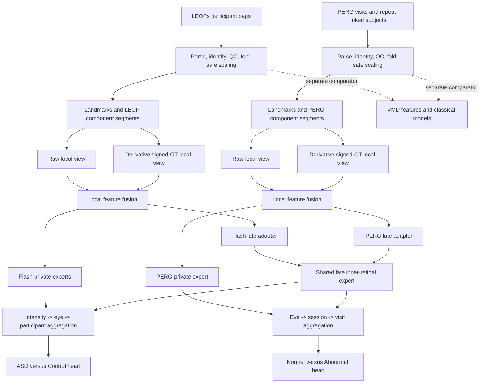

# PATH-ERG Master Research, Data, and Coding Plan

**Working method name:** PATH-ERG — Pathway-Aware Transfer for Heterogeneous Electroretinography  
**Working paper title:** *Pathway-Constrained Partial Transfer Across Unpaired Retinal Electrophysiology Protocols*  
**Document purpose:** complete implementation blueprint for the revised paper  
**Version:** 1.0, 2026-08-01  
**Status:** hypotheses and implementation decisions; no experimental conclusion is claimed in this document  
**Relationship to the earlier plan:** this is a standalone replacement plan centered on pathway-selective sharing. It keeps local signed optimal-transport geometry, retains raw morphology, and moves VMD to a corrected baseline/conditional extension.

---

## 0. How to read and execute this plan

Every major implementation step contains six items:

1. **Goal** — the output the step must produce.
2. **Why** — the scientific or engineering reason for doing it.
3. **Inputs** — the data or artifacts it may use.
4. **Implementation** — the required coding work.
5. **Checks** — tests that must pass.
6. **Deliverables / gate** — what must exist before the next step starts.

The order is deliberate. Do not build the neural model before the identities, labels, folds, QC manifests, and simple baselines are correct.

The paper has one central question:

> When two unpaired tests stimulate the same organ differently and measure only partially overlapping biological mechanisms, can an ML model share only the relevant mechanism-specific representation while preserving protocol-specific information?

The proposed answer is a hypothesis, not a conclusion:

> A pathway-constrained shared/private model may obtain useful transfer with less negative transfer than either complete separation or naive whole-waveform sharing.

---

## 1. Locked executive decisions

### 1.1 What is the main ML contribution?

**Decision:** the main contribution is a **component-to-pathway constrained partial-sharing architecture for unpaired physiological protocols with different labels**.

**Why:** generic self-supervision, CNNs, attention, optimal transport, VMD, shared/private networks, and multiple-instance learning already exist. The defensible new object is the explicit bipartite structure

\[
\text{waveform component} \longleftrightarrow \text{plausible physiological mechanism},
\]

which restricts where cross-protocol sharing is allowed.

### 1.2 Is this multimodal fusion?

**Decision:** do not call the cross-dataset operation ordinary multimodal fusion.

- There are no people measured in both datasets.
- Clinical labels have different meanings.
- There are no valid cross-dataset positive pairs.
- There is no patient-level concatenation of LEOPs and PERG.

Correct terminology:

- **within a dataset:** hierarchical set or multi-instance fusion;
- **between datasets:** unpaired pathway-aware multi-domain pretraining or partial transfer;
- **within a waveform component:** raw/transport multi-view feature fusion.

### 1.3 Will optimal transport be used?

**Decision:** yes. Use a **local derivative-SCDT-style signed optimal-transport descriptor** alongside a compact raw-waveform encoder.

**Why:** pathway sharing answers *where knowledge is shared*. Signed OT answers *how local waveform morphology and timing are represented*. These are complementary design layers.

Do not claim invention of signed OT. SCDT and related signed transport representations are prior art. The paper may claim a new pathway-conditioned use and learning architecture only if the final literature search supports that wording.

### 1.4 Will VMD be used?

**Decision:** yes, as a corrected classical baseline and conditional side-view experiment. It is not in the primary proposed model.

**Why:** VMD is useful for testing whether adaptive spectral modes add information, but mode identity is not physiological identity, short transient signals have boundary/mode-stability problems, and adding VMD to the main model immediately would obscure causal attribution.

### 1.5 What is shared?

**Primary sharing hypothesis:** only late, inner-retinal/RGC-enriched waveform information is permitted to use a cross-protocol shared expert.

- LEOPs candidate: broad late post-b-wave region, not an automatically assumed pure PhNR.
- PERG candidate: P50-to-N95 region, with emphasis on the N95 transition.

Both also retain protocol-private residual representations. They are not forced to be identical.

### 1.6 What remains private?

- flash early a-wave and a-to-b information;
- flash intensity-response trajectory parameters;
- flash oscillatory potentials;
- PERG N35-to-P50/macular-pattern information;
- device, stimulus, acquisition, and protocol-specific morphology;
- all clinical heads and clinical labels.

### 1.7 What is the primary training strategy?

1. Combined, label-free pretraining with alternating domain-balanced batches.
2. Shared late-pathway parameters see data from both protocols.
3. No cross-dataset sample matching or forced embedding-distribution alignment.
4. Copy the pretrained representation into two models.
5. Fine-tune LEOPs and PERG separately with patient/visit-level supervision.
6. Evaluate optional simultaneous multitask fine-tuning only as an ablation.

**Why:** this uses both datasets while avoiding label conflation and reduces the risk that a large PERG disease gradient damages an ASD representation, or vice versa.

---

## 2. Intended paper contributions and non-claims

### 2.1 Contribution hypotheses to test

1. **Problem formulation:** unpaired tests with partially overlapping generators, different acquisition protocols, nested repetitions, and unrelated clinical targets.
2. **Method:** a biologically constrained bipartite routing graph with shared pathway experts and protocol-private residual experts.
3. **Mathematical representation:** local raw plus derivative-signed-transport views with amplitude/mass retained.
4. **Theory:** a bias-variance analysis showing when partial sharing can reduce variance without unacceptable pathway-mismatch bias.
5. **Evaluation:** participant-safe comparison of no sharing, full sharing, generic learned sharing, correct pathway sharing, random sharing, and deliberately wrong sharing.
6. **Resource contribution:** a reproducible provenance-preserving schema and benchmark protocol spanning 11,097 functional curves from 557 people, while clearly distinguishing curves from independent subjects.

### 2.2 Claims that are prohibited unless independently established

- The two datasets form one cohort.
- ASD is equivalent to retinal disease or vice versa.
- PhNR and PERG N95 are the same signal.
- The late flash signal in every LEOP recording is a clean PhNR.
- Positive and negative mathematical variation correspond directly to retinal ON/OFF pathways.
- A VMD mode corresponds to a named retinal component.
- The model is clinically deployable or externally validated.
- A result is state of the art without matched eligibility and split definitions.
- The method is first without a final systematic search.
- A biological conclusion is true before the preregistered experiment supports it.

### 2.3 Success definition

The pathway claim is supported only if the proposed model:

1. outperforms or improves label efficiency relative to separate training on at least one endpoint;
2. does not materially degrade the other endpoint;
3. performs better than naive full sharing;
4. performs better than a parameter-matched random or wrong pathway graph;
5. remains credible after confound and grouped-split analyses;
6. shows that the late shared expert encodes relevant morphology rather than dataset/site identity alone.

If these do not hold, pivot according to Section 34 rather than rewriting hypotheses as conclusions.

---

## 3. Verified data inventory

All counts must be regenerated by code and written to `artifacts/audit/dataset_counts.json`. The following values are expectations from the current local audit, not hard-coded parser assumptions.

### 3.1 LEOPs

**Local source:** `LEOPs/jsons/*.json`  
**Cross-check:** `LEOPs/LEOPs_dataset.xlsx`

| Property | Current audited value |
|---|---:|
| Participants | 253 |
| Control | 157 |
| ASD | 75 |
| ASD + ADHD | 21 |
| Flash ERG waveforms | 5,309 |
| Available OP waveforms | 4,434 |
| Missing OP waveforms | 875 |
| Nine-step records | 4,246 |
| Two-step records | 415 |
| LA3 records | 648 |
| Nine-step participants | 173 |
| Two-step participants | 61 |
| LA3 participants | 217 |
| Nine-step/LA3 samples per trace | 235 |
| Two-step samples per trace | 430 |
| Sampling interval | 0.512 ms |
| Sampling rate | approximately 1,953.125 Hz |

Expected nine-step participant counts:

| Group | Participants | Waveforms | OP present |
|---|---:|---:|---:|
| Control | 88 | 2,165 | 2,005 |
| ASD | 72 | 1,710 | 1,281 |
| ASD + ADHD | 13 | 371 | 370 |

Primary LEOP endpoint:

- Control versus ASD;
- nine-step protocol;
- one prediction per participant;
- expected primary independent sample size: 160 participants;
- ASD + ADHD excluded from primary training and used exploratorily;
- incomplete eyes or intensities retained with masks when technically valid.

**Why nine-step:** it fixes the main protocol, provides an intensity-response trajectory, and reduces protocol-availability shortcuts.

Important confounds:

- strong sex imbalance by group;
- site imbalance;
- protocol availability;
- OP missingness;
- participant-specific repeated curves;
- electrode position and iris metadata;
- possible participant/group patterns in identifiers.

Important identity issue:

- 5,309 rows but only 5,243 unique `wave_id` values;
- `wave_id` must never be the sole key.

### 3.2 PERG-IOBA

**Local source root:** `a-comprehensive-dataset-of-pattern-electroretinograms-for-ocular-electrophysiology-research-the-perg-ioba-dataset-1.0.0/`  
**Metadata:** `csv/participants_info.csv`  
**Waveforms:** `csv/<id_record>.csv`

| Property | Current audited value |
|---|---:|
| Canonical subjects after repeat-link resolution | 304 |
| Visit records | 336 |
| Bilateral sessions | 677 |
| Eye curves | 1,354 |
| Samples per curve | 255 |
| Sampling rate | 1,700 Hz |
| Duration | approximately 150 ms |
| Age range | 4–86 years |
| Normal visit records | 106 |
| Observed diagnosis1 labels | 52 |
| Repeat-linked subjects | 23 |

Primary PERG endpoint:

- `diagnosis1 == "Normal"` versus any non-normal diagnosis;
- one prediction per visit;
- all visits from the same repeat-connected subject in one fold;
- secondary three-class endpoint only after clinician review.

Important issues:

- `rep_record` may contain multiple IDs and must be resolved as a graph;
- `NA` visual-acuity values must parse as null;
- sessions must not be averaged before modeling;
- labels belong to visits, while split groups belong to canonical subjects;
- unknown diagnoses must never silently default to a class;
- the acquisition curves are already averaged/artifact-controlled products, not raw electrode sweeps.

### 3.3 Combined description

| Source | Functional curves |
|---|---:|
| LEOP flash ERG | 5,309 |
| LEOP OP | 4,434 |
| PERG | 1,354 |
| Total | 11,097 |
| Unique people | 557 |

Never report 11,097 as the sample size for supervised inference. Independent sample sizes are participant or subject counts.

---

## 4. Biological component map and uncertainty policy

The model uses **enriched** or **associated** component language. It does not claim that a waveform window is generated by one cell class.

### 4.1 Component definitions

| Component ID | Dataset | Broad signal region | Working interpretation | Cross-protocol sharing |
|---|---|---|---|---|
| `L_EARLY_A` | LEOPs | stimulus to a-wave trough neighborhood | cone/outer-retinal enriched | forbidden |
| `L_A_TO_B` | LEOPs | a-wave trough through b-wave peak | bipolar/Müller dominated response | forbidden |
| `L_OP` | LEOPs | supplied OP waveform | amacrine/inner-retinal enriched | forbidden in primary model |
| `L_LATE` | LEOPs | b-wave peak to end/late trough | mixed late inner-retinal, possibly RGC-enriched | allowed |
| `P_EARLY` | PERG | N35 through P50 | macular-pattern and mixed P50 response | forbidden |
| `P_LATE` | PERG | P50 through N95 | RGC-enriched late response | allowed |

### 4.2 Primary pathway graph

The primary graph contains one cross-protocol pathway expert:

\[
L_{\mathrm{LATE}} \rightarrow E_{\mathrm{INNER}},
\qquad
P_{\mathrm{LATE}} \rightarrow E_{\mathrm{INNER}}.
\]

Every component also has a private route. Therefore:

\[
z_{L,\mathrm{late}}
=
z_{L,\mathrm{shared}} \oplus z_{L,\mathrm{private}},
\]

\[
z_{P,\mathrm{late}}
=
z_{P,\mathrm{shared}} \oplus z_{P,\mathrm{private}}.
\]

### 4.3 Why OP is not shared with N95

OPs are informative inner-retinal signals, but an OP-to-N95 equivalence would be too strong. OP activity is amacrine-enriched and high-frequency; N95 is a pattern-evoked RGC-enriched component. `L_OP -> E_INNER` is therefore an exploratory graph edge, not a primary edge.

### 4.4 Why the flash late region is not called a pure PhNR

- LEOP recordings have finite support and the late trough may be weak or truncated.
- The underlying ASD evidence is stronger for a/b and ON/OFF response differences than for PhNR.
- A prior ASD PhNR study did not establish a strong group effect.

Use `late post-b-wave region` in code and primary text. Report PhNR-like measurements only when landmark confidence and protocol support justify them.

### 4.5 Biological-prior uncertainty

Use a hard mask only for implausible edges. Use a learnable gate for permitted edges:

\[
g_{d,c,r}=M_{d,c,r}\,\sigma(a_{d,c,r}),
\]

where `M=0` forbids a route and `M=1` permits learning its strength.

Regularize permitted gates gently toward a prespecified prior, not toward certainty:

\[
\mathcal L_{\mathrm{prior}}
=
\sum_{M_{d,c,r}=1}w_{d,c,r}(g_{d,c,r}-g^0_{d,c,r})^2.
\]

Primary starting prior for the two late edges: `g0 = 0.75`. Treat `0.5` and `0.9` as sensitivity settings. Do not optimize this value on the outer test folds.

---

## 5. System mind map



One-sentence architecture:

> Each physiological component is encoded from raw and signed-transport views, routed to a protocol-private expert and, only when biologically permitted, a shared late-pathway expert; nested set aggregation then produces separate patient-level predictions.

---

## 6. Formal learning problem

Let dataset/domain be `d in {L, P}`. A participant or visit bag is

\[
B_i^{(d)}=\{x_{ij}^{(d)}, t_{ij}^{(d)}, m_{ij}^{(d)}\}_{j=1}^{n_i},
\]

where `x` is a waveform, `t` timestamps, and `m` contains non-outcome acquisition metadata such as eye, intensity, session, and protocol.

Clinical labels are distinct:

\[
y_i^{(L)}\in\{\mathrm{Control},\mathrm{ASD}\},
\]

\[
y_v^{(P)}\in\{\mathrm{Normal},\mathrm{Abnormal}\}.
\]

There is no common label `y` and no cross-domain paired observation.

For component `c`, define preprocessing/segmentation transform

\[
S_{d,c}(x,t)=(x_{d,c},t_{d,c},q_{d,c}),
\]

where `q` includes landmark and segment confidence.

Local representation:

\[
u_{d,c}
=
F_{d,c}
\left(
E^{\mathrm{raw}}_{d,c}(x_{d,c})
\oplus
E^{\mathrm{OT}}_{d,c}(\Phi_{\mathrm{sOT}}(x_{d,c},t_{d,c}))
\oplus
f^{\mathrm{physical}}_{d,c}
\right).
\]

Pathway/private representation:

\[
z_{d,c}
=
E^{\mathrm{private}}_{d,c}(u_{d,c})
\oplus
\sum_r g_{d,c,r}
E^{\mathrm{shared}}_r(A_{d,c}u_{d,c}).
\]

Hierarchical bag representation:

\[
h_i^{(d)}=\rho_d\left(\{z_{d,c,j},m_{d,c,j},q_{d,c,j}\}_{j=1}^{n_i}\right).
\]

Separate predictions:

\[
\hat y_i^{(L)}=H_L(h_i^{(L)}),
\qquad
\hat y_v^{(P)}=H_P(h_v^{(P)}).
\]

---

## 7. Mathematical waveform representation

### 7.1 Goal

Represent the temporal geometry of rising and falling waveform variation while retaining polarity, amplitude, duration, and classical clinical features.

### 7.2 Why

- ERGs are signed/bipolar signals.
- Classical OT assumes nonnegative equal-mass measures.
- Timing shifts and morphology are often better represented by transport than pointwise Euclidean distance.
- Per-curve z-scoring would destroy clinically relevant amplitude.
- Derivatives remove constant offsets but amplify noise, so a separate smoothed copy is required.

### 7.3 Construction

For a smoothed local component `x_s(t)`, compute a spacing-aware derivative

\[
v(t)=\frac{d x_s(t)}{dt}.
\]

Split variation:

\[
v^+(t)=\max(v(t),0),
\qquad
v^-(t)=\max(-v(t),0).
\]

Masses:

\[
m^+=\int v^+(t)dt,
\qquad
m^-=\int v^-(t)dt.
\]

When a mass exceeds numerical tolerance, normalize:

\[
p^+(t)=v^+(t)/m^+,
\qquad
p^-(t)=v^-(t)/m^-.
\]

Compute discrete CDFs and inverse-CDF/quantile maps on a fixed reference grid. The reference implementation uses 64 quantiles for each sign:

\[
\Phi_{\mathrm{sOT}}
=
[Q^+_{1:64},Q^-_{1:64},
\log(m^++\epsilon),\log(m^-+\epsilon),
m^+-m^-,m^++m^-,b^+,b^-],
\]

where `b+` and `b-` are validity flags.

The raw branch receives the 128-point local waveform. The physical side vector retains amplitude, latency, area, duration, peak-to-peak, slopes, baseline statistics when valid, and landmark confidence.

### 7.4 Local signed-OT distance

For two components of the same type and domain:

\[
D_{\mathrm{sOT}}^2(x_i,x_j)
=
W_2^2(p_i^+,p_j^+)
+
W_2^2(p_i^-,p_j^-)
+
\lambda_m
\left\|
\log(m_i+\epsilon)-\log(m_j+\epsilon)
\right\|_2^2.
\]

Use this for representation probes and an optional within-component geometry-preservation loss. Do not force arbitrary LEOP and PERG participants to be close under this distance.

### 7.5 Edge cases

- If `m+ < tolerance`, fill the positive quantile vector with zeros and set `b+=0`.
- If `m- < tolerance`, do the same for the negative branch.
- Retain the masses; never silently add enough epsilon to fabricate a distribution.
- If both masses are negligible, flag a near-flat technical or physiological trace; do not automatically exclude it.
- Compute derivatives using physical timestamps before resampling when possible.
- Store the smoothing parameters and transform version in every cache manifest.

### 7.6 Interpretation boundary

`v+` and `v-` mean upward and downward voltage variation. They do not mean retinal ON and OFF pathways. Biological interpretation is attached to the stimulus and component window, not to mathematical sign alone.

### 7.7 Coding interface

```python
@dataclass(frozen=True)
class SignedOTResult:
    q_pos: np.ndarray          # [64]
    q_neg: np.ndarray          # [64]
    mass_pos: float
    mass_neg: float
    valid_pos: bool
    valid_neg: bool
    total_variation: float
    net_variation: float
    transform_version: str

def signed_derivative_ot(
    time_ms: np.ndarray,
    signal_uv: np.ndarray,
    smoothing: SmoothingConfig,
    n_quantiles: int = 64,
    mass_tolerance: float = 1e-8,
) -> SignedOTResult:
    ...
```

### 7.8 Required tests

1. Constant-offset invariance of derivative transport.
2. Known time-shift behavior on synthetic peaks.
3. Positive amplitude-scaling changes masses but not normalized quantiles.
4. Stable zero-mass handling.
5. Nonuniform timestamp integration.
6. No NaN/Inf output.
7. Determinism.
8. Agreement with a direct 1D Wasserstein calculation on synthetic distributions.
9. Reconstruction/sufficiency sanity when initial level and masses are retained.
10. Noise sensitivity across the approved smoothing grid.

---

## 8. Landmark detection and component segmentation

### 8.1 General policy

Landmarks are detected from a lightly smoothed copy. Raw values are preserved for the raw encoder. Detection is label-independent and never tuned on outer-test labels.

Each landmark returns:

- time;
- amplitude;
- confidence;
- detection source (`metadata`, `automatic`, or `fallback`);
- plausibility flags;
- uncertainty window.

Broad windows and fallbacks are intentional. A missed landmark must reduce confidence, not delete an entire participant by default.

### 8.2 LEOP landmark strategy

Expected search regions after stimulus onset:

| Landmark | Initial search range | Selection |
|---|---:|---|
| a trough | 5–25 ms | minimum with prominence and boundary checks |
| b peak | max(a+5 ms, 15 ms)–55 ms | maximum with prominence and ordering checks |
| late trough | max(b+10 ms, 55 ms)–end | minimum if support/confidence permits |

Compare automatic a/b landmarks with the supplied feature values. Do not assume the supplied values are error-free. Large disagreement becomes a QC flag.

Reference component windows:

- `L_EARLY_A`: 0 ms through `a_time + 5 ms`, bounded to 0–30 ms.
- `L_A_TO_B`: `a_time - 5 ms` through `b_time + 10 ms`.
- `L_LATE`: `b_time - 5 ms` through min(end, 110 ms).
- `L_OP`: entire supplied OP support plus an optional landmark-aligned 0–80 ms view.

Fallbacks:

- missing a: use fixed 5–25 ms window and confidence 0;
- missing b: use fixed 20–60 ms window and confidence 0;
- missing late trough: keep b-to-end segment and mark trough invalid;
- truncated support: preserve actual duration and truncation flag.

### 8.3 PERG landmark strategy

Initial search regions:

| Landmark | Initial range | Selection |
|---|---:|---|
| N35 | 20–45 ms | local minimum |
| P50 | max(N35+5 ms, 35 ms)–70 ms | local maximum |
| N95 | max(P50+10 ms, 65 ms)–130 ms | local minimum |

Reference components:

- `P_EARLY`: `N35 - 10 ms` through `P50 + 10 ms`.
- `P_LATE`: `P50 - 10 ms` through `N95 + 20 ms`, bounded by available support.

Fallbacks:

- use broad fixed windows 15–75 ms and 40–135 ms;
- retain confidence and boundary indicators;
- never discard solely because N35 is poorly expressed.

### 8.4 Relative-phase canonicalization for the shared late branch

For a positive-to-negative transition with positive landmark `t_pos` and negative landmark `t_neg`, define

\[
s=\frac{t-t_{\mathrm{pos}}}{t_{\mathrm{neg}}-t_{\mathrm{pos}}}.
\]

Resample `s in [-0.2, 1.2]` to 128 points using PCHIP or linear interpolation. Retain:

- physical `t_neg - t_pos`;
- positive and negative amplitudes;
- physical area and slopes;
- original support length;
- landmark confidence;
- protocol token.

**Why:** relative phase provides a comparable positive-to-negative morphology without pretending the physical latencies are identical. Retained duration prevents time normalization from erasing latency.

If either late landmark is invalid, use absolute-time fallback with a distinct mask. Never extrapolate beyond observed support.

### 8.5 Coding interfaces

```python
@dataclass(frozen=True)
class Landmark:
    name: str
    time_ms: float | None
    amplitude_uv: float | None
    confidence: float
    source: str
    flags: tuple[str, ...]

@dataclass(frozen=True)
class Segment:
    component_id: str
    time_ms: np.ndarray
    signal_uv: np.ndarray
    canonical_time: np.ndarray
    canonical_signal: np.ndarray
    physical_features: np.ndarray
    confidence: float
    flags: tuple[str, ...]

def detect_leops_landmarks(recording: Recording) -> dict[str, Landmark]: ...
def detect_perg_landmarks(recording: Recording) -> dict[str, Landmark]: ...
def build_component_segments(recording: Recording, landmarks: dict) -> list[Segment]: ...
```

### 8.6 Checks and gate

- visually review stratified random examples from every protocol, site, class, eye, and intensity;
- plot automatic versus supplied a/b values;
- quantify fallback frequency by group/site/diagnosis;
- train a fallback-mask-only classifier; strong predictive power blocks use until analyzed;
- synthetic peaks must be recovered within prespecified tolerance;
- segment bounds must never exceed observed timestamps;
- no clinical label may enter detection.

Gate: at least 95% of technically valid curves yield usable broad segments, while confidence/fallback rates show no unexplained severe class imbalance.

---

## 9. Reference neural architecture

### 9.1 Design goal

Use a compact model that expresses the hypothesis directly and remains appropriate for only hundreds of independent people.

Target trainable parameter budget:

- primary model: 0.5–1.0 million parameters;
- hard maximum without separate justification: 1.5 million;
- report exact counts for every baseline.

### 9.2 Local raw stem

Reference input: `[batch, 1, 128]` plus valid-sample mask.

Reference blocks:

1. Conv1d `1 -> 16`, kernel 7, padding 3.
2. Residual block `16 -> 32`, kernels 5 and 3, stride 2.
3. Residual block `32 -> 64`, kernels 5 and 3, stride 2.
4. Masked global average and maximum pooling.
5. Linear projection to 64 dimensions.

Use GroupNorm or LayerNorm, not BatchNorm as the default, because bag sizes and domain-balanced batches can be small.

### 9.3 Signed-OT stem

Reference input:

- 64 positive quantiles;
- 64 negative quantiles;
- two log masses;
- total and net variation;
- two validity flags.

Reference MLP:

`134 -> 128 -> 64`, GELU, LayerNorm, dropout 0.1.

### 9.4 Physical-feature stem

Candidate features:

- duration;
- minimum/maximum/peak-to-peak;
- positive and negative peak latency;
- area above/below local reference;
- rising/falling maximum slope;
- log positive/negative variation mass;
- landmark confidence;
- truncation/fallback masks.

Do not include age, sex, site, diagnosis, participant ID, file path, or label-coded metadata.

Reference MLP: `p -> 32 -> 16`.

### 9.5 Raw/OT feature fusion

Let raw, transport, and physical embeddings be `r`, `o`, and `f`. Compute

\[
\alpha=\sigma(W_\alpha[r\oplus o\oplus f]),
\]

\[
u=W_u[\alpha\odot r\oplus(1-\alpha)\odot o\oplus f].
\]

Reference output dimension: 96.

Store mean fusion gates by component and fold for interpretation. Gate values are descriptive, not causal biological measurements.

### 9.6 Protocol adapters

Two-layer residual MLPs map local tokens into the shared expert input space:

- `A_flash_late: 96 -> 64 -> 64`;
- `A_perg_late: 96 -> 64 -> 64`.

Adapters are always separate. They absorb amplitude scale, stimulus, electrode, and morphology differences before any shared parameters.

### 9.7 Experts

Primary experts:

- `FlashEarlyPrivateExpert`;
- `FlashOPPrivateExpert`;
- `FlashLatePrivateExpert`;
- `PERGEarlyPrivateExpert`;
- `PERGLatePrivateExpert`;
- `SharedInnerLateExpert`.

Each reference expert is a residual MLP `64/96 -> 96 -> 64` with LayerNorm and dropout 0.1.

Late token output includes both shared and private pieces. Non-late tokens never access `SharedInnerLateExpert` in the primary graph.

### 9.8 LEOP hierarchical aggregation

Hierarchy:

```text
component tokens
-> one flash/intensity token
-> intensity-conditioned eye set
-> participant set of eyes
-> participant representation
```

At the intensity level, concatenate embeddings for available early, a-to-b, late, and OP components with component masks.

Add continuous intensity embedding based on log flash Td·s, not acquisition array position.

Use gated attention:

\[
a_j \propto \exp\{w^\top[\tanh(Vz_j)\odot\sigma(Uz_j)]\},
\qquad
h=\sum_j a_jz_j.
\]

Use separate attention modules for intensity-to-eye and eye-to-participant. Include eye token and protocol token. Missing elements are masked, not zero-valued observations.

### 9.9 PERG hierarchical aggregation

Hierarchy:

```text
early and late components
-> eye token
-> bilateral session set
-> visit set of sessions
-> visit representation
```

Preserve every session. Do not average sessions before encoding. Session order is not assumed to be longitudinal unless the metadata supports it; the primary aggregator is permutation invariant.

### 9.10 Heads

- LEOP head: `128 -> 64 -> 1` logit.
- PERG head: `128 -> 64 -> 1` logit.
- optional auxiliary heads are removed at inference.
- calibration is fitted after model selection on inner out-of-fold predictions.

### 9.11 Model outputs for auditability

Every forward pass may optionally return:

- local raw embedding;
- local OT embedding;
- raw/OT fusion gate;
- shared and private late embeddings;
- pathway gate;
- attention weights at each hierarchy;
- masks and confidence;
- final logit.

The default training path returns only necessary tensors to control memory.

---

## 10. Bias-variance theory work package

### 10.1 Goal

Provide a mathematical explanation for why partial sharing can outperform both no sharing and full sharing.

### 10.2 Minimal linear proposition

Assume two protocols estimate pathway parameters `theta_1` and `theta_2` with orthonormal linear designs, dimension `p`, noise variance `sigma^2`, and sample sizes `n_1`, `n_2`. Let

\[
\Delta=\theta_2-\theta_1.
\]

Separate estimation risk for task 1 is approximately

\[
R_{\mathrm{sep},1}=\frac{\sigma^2p}{n_1}.
\]

A pooled estimate has

\[
R_{\mathrm{pool},1}
=
\frac{\sigma^2p}{n_1+n_2}
+
\left(\frac{n_2}{n_1+n_2}\right)^2\|\Delta\|_2^2.
\]

Sharing helps task 1 when the variance reduction exceeds the mismatch bias:

\[
\left(\frac{n_2}{n_1+n_2}\right)^2\|\Delta\|_2^2
<
\sigma^2p\left(\frac1{n_1}-\frac1{n_1+n_2}\right).
\]

### 10.3 Extension to pathway blocks

Partition parameters into pathway blocks `r=1,...,R`. A pathway graph shares only selected blocks. Derive total risk as the sum of:

- shared-block reduced variance;
- shared-block mismatch bias;
- private-block separate-estimation variance.

Show that the oracle graph shares block `r` only when its mismatch is below its variance-reduction threshold.

### 10.4 Learnable-gate interpretation

Interpret `g_r` as a continuous relaxation of the share/private decision. Analyze a shrinkage estimator

\[
\hat\theta_{1,r}(g_r)
=(1-g_r)\hat\theta_{1,r}
+g_r\hat\theta_{\mathrm{pool},r}.
\]

Derive or bound optimal `g_r` under squared loss. This connects the biological prior to a statistically meaningful bias-variance control.

### 10.5 Synthetic verification

Generate partially shared signals with known pathway blocks, controlled mismatch, noise, sample imbalance, timing shift, and protocol transforms. Verify:

- full sharing wins at zero mismatch;
- separate training wins at high mismatch;
- pathway partial sharing wins in the middle regime;
- learned gates correlate with the simulated oracle sharing level;
- incorrect graphs create measurable negative transfer.

### 10.6 Deliverables

- theorem/proposition statement with assumptions;
- proof in supplement;
- simulation code and fixed seeds;
- bias-variance phase diagram;
- no theorem claim beyond the actual proved setting.

---

## 11. Canonical data model and storage

### 11.1 Goal and why

Create one versioned, provenance-preserving representation that supports both datasets without erasing their different hierarchies. Training from ad hoc JSON/CSV rows would make identity errors, silent duplication, fold leakage, and inconsistent preprocessing likely.

### 11.2 Storage layout

    data/
      raw/                         # configured external paths; never modified
      manifests/
        raw_files.parquet
        build_manifest.json
      interim/
        participants.parquet
        visits.parquet
        sessions.parquet
        recordings.parquet
        components.parquet
        labels.parquet
        qc_manifest.parquet
      arrays/
        raw_curves.zarr
        component_curves.zarr
        signed_ot.zarr
        vmd_modes.zarr             # baseline cache only
      splits/
        outer_folds_v1.parquet
        inner_folds_v1.parquet
        split_summary_v1.json

### 11.3 Canonical tables

participants.parquet, one row per canonical person:

    global_subject_id, dataset, source_subject_id, repeat_component_id,
    age_years, sex_raw, sex_standardized, site, group_raw,
    participant_qc_flags, source_checksum

visits.parquet, one row per clinical/study record:

    global_visit_id, global_subject_id, dataset, source_record_id, visit_date,
    diagnosis1_raw, diagnosis2_raw, diagnosis3_raw,
    target_binary, target_multiclass, target_mapping_version, visit_qc_flags

For LEOPs, the visit abstraction is only for schema consistency; it must not imply longitudinal clinical follow-up.

sessions.parquet:

    global_session_id, global_visit_id, dataset, source_session_index,
    session_type, acquisition_timestamp_start, eyes_available, session_qc_flags

recordings.parquet, one row per physical waveform:

    global_recording_id, global_subject_id, global_visit_id, global_session_id,
    dataset, protocol, eye, stimulus_value, stimulus_unit, waveform_kind,
    source_wave_id, source_file, source_row_or_column, array_key,
    n_samples, start_ms, end_ms, median_dt_ms, sampling_rate_hz,
    erg_pair_id, recording_qc_flags

The LEOP key must include participant, protocol, date/time, eye, unrounded stimulus, raw wave_id, and a deterministic source index/hash.

components.parquet, one row per segmented physiological region:

    global_component_id, global_recording_id, component_id,
    segment_start_ms, segment_end_ms, canonicalization_type,
    canonical_array_key, raw_array_key, landmark_times_json,
    landmark_amplitudes_json, landmark_confidence, fallback_used,
    physical_features_json, signed_ot_array_key,
    component_qc_flags, transform_version

qc_manifest.parquet stores measurements and decisions separately, including finite fraction, timestamp validity, sampling rate, baseline/noise summaries, peak-to-peak, total variation, derivative MAD, flatline fraction, boundary jump, clipping flags, landmark confidence, OT masses, VMD stability, thresholds, threshold-estimation fold, and exclusion reason.

### 11.4 Checks and gate

- every foreign key and array key resolves;
- IDs are unique;
- expected counts are reproduced;
- no curve belongs to two people/visits;
- ERG/OP pairs agree on subject, protocol, eye, and stimulus;
- PERG eyes agree on visit/session;
- repeated builds from unchanged inputs yield identical manifest hashes.

Gate: the deterministic data build passes twice before model development.

---

## 12. Step-by-step data engineering and preprocessing

### Step 12.1 — environment and dependency lock

**Goal:** create a reproducible Python environment.

**Why:** numerical transforms, Parquet/Zarr, VMD, and PyTorch behavior can change across versions.

**Implementation:** use Python 3.11 with pinned NumPy, SciPy, pandas, PyArrow, Zarr, scikit-learn, PyTorch, torchmetrics, a maintained pinned VMD implementation, plotting/statistics libraries, typed configuration, pytest, Hypothesis, Ruff, and mypy. Record CUDA, driver, CPU, OS, and package versions per run.

**Checks:** clean CPU environment imports everything and completes a deterministic smoke run.

**Deliverable/gate:** pyproject.toml, lock file, and environment_report.json.

### Step 12.2 — immutable raw-file audit

**Goal:** inventory every source file and prove raw data remain untouched.

**Why:** reproducibility requires exact provenance and version detection.

**Implementation:** recursively enumerate raw roots; store relative path, bytes, SHA-256, modification time, parser type, dataset version, license/citation status; verify provided PERG checksums when possible.

**Checks:** no duplicate paths, no unresolved references, explicit checksum pass/fail.

**Deliverable/gate:** raw_files.parquet, raw_audit.json, and license_report.md.

### Step 12.3 — LEOP ingestion

**Goal:** parse all participant JSONs into typed participant and recording objects.

**Why:** JSON preserves hierarchy and avoids double-counting flattened spreadsheet rows.

**Implementation:** preserve raw codes and demographics; parse recording age, protocol, eye, date/time, electrode, iris, stimulus, supplied features, ERG, and optional OP; validate time/amplitude lengths; keep exact intensity plus a separate rounded bin; build collision-safe IDs; link ERG/OP; cross-check aggregates against XLSX without ingesting it as duplicate observations.

**Checks:** 253 people, 5,309 ERGs, 4,434 OPs; increasing time; duplicate raw wave_id values do not duplicate global IDs.

**Deliverable/gate:** LEOP tables and discrepancy report.

### Step 12.4 — PERG ingestion

**Goal:** parse 336 visits and every bilateral session without averaging.

**Why:** prototype code averages sessions, treats records as people, and mishandles NA values.

**Implementation:** parse missing numeric values explicitly; preserve diagnoses; parse each header triplet TIME_k, RE_k, LE_k by name; convert timestamps to elapsed milliseconds; validate eyes and lengths; store every eye/session; never zero-pad missing physiology.

**Checks:** 336 visits, 677 sessions, 1,354 eye curves, typically 255 samples and approximately 1,700 Hz.

**Deliverable/gate:** PERG visit/session/recording tables and ingestion report.

### Step 12.5 — PERG identity graph

**Goal:** recover 304 canonical subjects.

**Why:** repeat-linked visits in different folds create direct leakage.

**Implementation:** normalize rep_record, extract/validate IDs, form undirected edges, run union-find, assign stable components, report within-person conflicts, retain visit-specific diagnosis while splitting by subject.

**Checks:** exactly 304 components with expected sizes 281x1, 19x2, 1x3, 1x4, 2x5.

**Deliverable/gate:** identity-component table and conflict report.

### Step 12.6 — label construction

**Goal:** produce locked, reviewable endpoints.

**Why:** label mapping is part of the scientific protocol, not hidden loader logic.

**LEOP:** exact Control/ASD primary mapping; exclude ASD+ADHD from primary training; eligibility requires at least one technically valid nine-step curve.

**PERG:** exact normalized Normal to 0; every other nonempty diagnosis1 to 1 for the binary endpoint; null diagnosis is ineligible. Create a versioned diagnosis_mapping.csv with every raw label, count, mappings, rationale, reviewer, and date. Clinician review is mandatory before a three-class endpoint.

**Checks:** no fallback/default class; every label is mapped explicitly; mapping hash stored in runs; label text never reaches predictors.

**Deliverable/gate:** locked label tables.

### Step 12.7 — hard technical validity

**Goal:** reject only structurally unusable curves before fold-dependent QC.

**Why:** low amplitude, unusual timing, or flat morphology may be disease biology.

Hard failures: empty/unparseable arrays, time-amplitude mismatch, under 95% finite values, unrepairable nonmonotonic time, more than one isolated nonfinite gap, broken subject/visit linkage, impossible eye/session linkage, or inadequate points for interpolation. At most one isolated nonfinite value may be interpolated and flagged.

**Checks:** every exclusion has an exact reason; report class/site distributions before and after.

**Deliverable/gate:** technically valid population manifest.

### Step 12.8 — timestamp and unit harmonization

**Goal:** express physical time in milliseconds while retaining native grids.

**Why:** 1,953.125 Hz and 1,700 Hz arrays cannot be compared by index.

**Implementation:** LEOP uses supplied time_ms; PERG subtracts each session's first absolute timestamp and converts to ms; infer dt and sampling rate; keep native arrays for integration/VMD; resample only after segmentation.

**Checks:** duration/rate histograms by protocol; no hard-coded 1,667 Hz.

**Deliverable/gate:** sampling audit and unit-consistent recordings.

### Step 12.9 — baseline and offset handling

**Goal:** control technical offsets without deleting amplitude.

**Why:** LEOP has negative-time support; PERG does not have an equivalent stored pre-stimulus baseline.

**LEOP primary:** compute pre-stimulus median/MAD/slope; subtract the median only from the modeling copy; retain statistics for QC, not unrestricted prediction.

**PERG primary:** do not label the first ten samples a baseline. Keep source level for the raw branch and use fold-fitted scaling; derivative OT is offset invariant. Compare no centering, whole-trace median centering, and robust low-order detrending as inner/sensitivity variants.

**Checks:** peak-to-peak invariance to constant centering; synthetic offsets; before/after plots.

**Deliverable/gate:** fold-specific offset-policy artifact.

### Step 12.10 — smoothing copies

**Goal:** obtain stable derivatives/landmarks without filtering the only raw signal.

**Why:** differentiation amplifies noise.

**Implementation:** retain a minimally processed raw copy; reference OT/landmark copy uses Savitzky-Golay order 3 and approximately 3 ms duration; test 2, 3, 5 ms and a smoothing spline; express windows in milliseconds and convert to valid odd sample counts per dataset.

**Checks:** latency shift, amplitude attenuation, derivative noise, and OT stability on synthetic/real examples.

**Deliverable/gate:** locked reference and sensitivity smoothing configurations.

### Step 12.11 — landmarks and segmentation

**Goal:** generate Section 8 component objects.

**Why:** whole-wave sharing compares nonhomologous biology.

**Implementation:** run dataset-specific detectors, broad-window fallbacks, relative-phase late canonicalization, confidence masks, and physical features.

**Checks:** visual HTML audit across protocol/site/class/eye/intensity; supplied-versus-detected a/b plots; fallback-only classifier.

**Deliverable/gate:** versioned component tables/arrays.

### Step 12.12 — component resampling

**Goal:** fixed 128-point local inputs without extrapolation.

**Why:** encoders need fixed shapes but source grids differ.

**Implementation:** PCHIP primary, linear sensitivity; nearest logic for masks; store physical support/duration; never extrapolate; apply relative-phase grid only where observed.

**Checks:** overshoot/reconstruction report and exact valid masks.

**Deliverable/gate:** component_curves.zarr.

### Step 12.13 — fold-safe amplitude scaling

**Goal:** numerically stable inputs without per-curve amplitude destruction.

**Why:** per-curve z-scoring erases signal; pre-split global scaling leaks.

**Implementation:** fit median and 1.4826 times MAD, with IQR fallback, on outer-training people only, stratified by dataset/protocol/waveform/component as needed; reuse on validation/test; preserve physical microvolt features; save scaler hashes.

**Checks:** test IDs absent from fit; finite scaled values; no per-curve standard-deviation division.

**Deliverable/gate:** fold-specific scalers.

### Step 12.14 — signed-OT cache

**Goal:** precompute deterministic transport descriptors.

**Why:** identical cached representations make model comparisons fair and faster.

**Implementation:** run Section 7 transform with source, smoothing, segment, and transform hashes.

**Checks:** transform unit tests and exact random cache regeneration.

**Deliverable/gate:** indexed signed_ot.zarr.

### Step 12.15 — fold-dependent QC

**Goal:** flag technical outliers without label-driven cleaning.

**Why:** thresholds from all data or optimized for outcome cause leakage and selection bias.

**Implementation:** outer-training robust thresholds; initially flag high noise, derivative MAD, boundary jump, saturation, unusual rate, poor landmark order/support, and extreme variation. Lock three populations: all technically valid, high-QC sensitivity, and complete bilateral/full-intensity sensitivity.

**Checks:** QC-only classifier; flag rates by class/site/age/sex; compare populations.

**Deliverable/gate:** threshold files and population masks.

### Step 12.16 — missingness

**Goal:** retain partial bags without representing absence as zero physiology.

**Why:** OP, eye, intensity, session, and metadata absence can be structural and predictive.

**Implementation:** learned missing token plus internal mask for OP; omit missing set elements and preserve counts/masks; exclude clinical/demographic metadata from primary signal-only heads; impute only secondary metadata within training folds.

**Checks:** missingness-only/bag-size baselines and matched complete-case sensitivity.

**Deliverable/gate:** missingness policy and shortcut report.

### Step 12.17 — training augmentation

**Goal:** small physiologically plausible training perturbations.

**Why:** improve robustness without impossible peak order or wraparound.

Allowed initial transforms: gain 0.90–1.10, small colored noise, small constant offset, padded plus/minus 1–2 ms shift, one/two 2–5 ms masks, low-amplitude drift, and neighboring approved smoothing.

Prohibited: circular roll, inversion, reversal, large warp, sample permutation, participant mixing, GAN curves, label-conditioned synthesis, component-destructive cropping, and per-curve z-normalization.

**Checks:** landmark order preserved, no wraparound, review montage, seeded reproducibility.

**Deliverable/gate:** augmentation module and validation report.

---

## 13. Split construction and leakage prevention

### 13.1 Goal and why

Create one locked nested grouped evaluation used by every model. Thousands of correlated curves must never replace hundreds of independent people in the split or supervised loss.

### 13.2 Outer folds

Use five outer folds.

- LEOP: group by participant; balance Control/ASD, site, sex, and age bins; keep all curves/protocols/eyes/OP with the person.
- PERG: group by canonical 304-subject component; balance normal/abnormal, sex, age bins, and visit counts; keep all visits/sessions/eyes with the subject.
- Joint fold k excludes fold k people from combined SSL as well as supervised training.

### 13.3 Inner folds

Use four grouped inner folds. Fit scaling, QC thresholds, preprocessing variants, hyperparameters, VMD, early stopping, threshold selection, calibration, and feature selection only here.

### 13.4 Construction

Use deterministic stratified group assignment minimizing deviations in class, site/sex, age bins, positive/negative counts, and PERG visits per subject. Freeze after balance review; do not regenerate after model results.

### 13.5 Automated leakage assertions

1. no canonical subject in two partitions;
2. no waveform checksum duplicate across partitions;
3. ERG/OP pairs remain together;
4. repeat-linked PERG visits remain together;
5. scalers/QC/selectors use training IDs only;
6. no test curve in SSL;
7. no pre-split feature selection;
8. IDs, paths, diagnoses, and source order are absent from tensors;
9. supervised loss is one item per LEOP participant or PERG visit;
10. all compared models use identical test IDs.

### 13.6 Seeds and gate

Use one locked nested manifest and three paired neural seeds for final models. Additional split repetitions are a limited sensitivity analysis.

Deliverables: outer/inner Parquet manifests, fold-balance report, split hash, and passing leakage tests. No benchmark begins before this gate.

---

## 14. Self-supervised and supervised objectives

### 14.1 Stage A — local representation sanity

**Goal:** verify raw and OT encoders before cross-dataset sharing.

**Why:** if the representation cannot recover morphology/timing on simple probes, a larger shared model will hide the failure.

**Implementation:** train compact component encoders and probes to reconstruct masked samples, predict controlled synthetic shifts and gains, recover a/b or P50/N95 summaries, preserve signed-OT neighborhood order, and quantify dataset/protocol information.

**Checks:** compare raw, OT, and raw+OT; inspect collapse, amplitude retention, and noise sensitivity.

**Gate:** OT must add stable timing, robustness, label efficiency, or complementarity. If it does not, keep it as a mathematical baseline rather than forcing it into the final neural model.

### 14.2 Stage B — combined label-free pretraining

**Goal:** expose only permitted shared parameters to both datasets without aligning labels or people.

**Why:** both datasets should contribute useful gradients, but raw curve count must not let LEOP dominate and unrelated diagnoses must not be mixed.

**Implementation:** alternate one domain-balanced LEOP batch and one domain-balanced PERG batch, or accumulate equal-weight gradients from both before each optimizer step. Held-out outer-fold people are excluded.

Reference objective:

\[
\mathcal L_{\mathrm{SSL}}
=
\lambda_{\mathrm{mask}}\mathcal L_{\mathrm{mask}}
+
\lambda_{\mathrm{view}}\mathcal L_{\mathrm{raw\leftrightarrow OT}}
+
\lambda_{\mathrm{aug}}\mathcal L_{\mathrm{aug}}
+
\lambda_{\mathrm{geom}}\mathcal L_{\mathrm{geom}}
+
\lambda_{\mathrm{prior}}\mathcal L_{\mathrm{prior}}.
\]

Reference starting weights:

    lambda_mask  = 1.00
    lambda_view  = 0.25
    lambda_aug   = 0.25
    lambda_geom  = 0.10
    lambda_prior = 0.01

These are development starting points, not result-derived final values.

### 14.3 Masked reconstruction

Mask short contiguous spans of the local raw component. Decode from the fused representation and unmasked context. Calculate Huber/MSE only on masked values.

**Goal:** learn local response structure without diagnosis labels.

### 14.4 Raw-to-OT consistency

Project raw and OT embeddings into a small normalized SSL space and maximize agreement for the two views of the same component. Use a VICReg-style or other collapse-controlled noncontrastive loss.

**Why:** raw samples and transport coordinates are two descriptions of one signal.

Do not force the complete embeddings to be identical; raw amplitude/private information can be complementary. Projection heads are discarded after pretraining.

### 14.5 Augmentation consistency

Two safe augmentations of the same component form a positive pair. Do not automatically treat different patients as negatives, and do not create cross-dataset positive pairs.

### 14.6 Geometry preservation

Within the same dataset and component type, sample pairs and preserve ranked signed-OT distances:

\[
\mathcal L_{\mathrm{geom}}
=
\operatorname{Huber}
\left(
\widetilde d_z(i,j)-\widetilde D_{\mathrm{sOT}}(i,j)
\right).
\]

Normalize distances using training-fold statistics. The primary model has no arbitrary cross-domain pairwise geometry loss.

### 14.7 Physiological auxiliary objectives

LEOP candidates:

- flash intensity prediction;
- a-wave amplitude/latency;
- b-wave amplitude/latency;
- b/a ratio;
- OP energy/summary;
- intensity-order or eye-consistency prediction.

PERG candidates:

- detected P50/N95 amplitude/latency;
- P50-to-N95 duration;
- repeat-session consistency;
- left/right eye relation.

**Why:** these label-free or acquisition-derived targets anchor branches to observable physiology. Weight targets by landmark confidence. Keep only objectives that improve probes/stability; do not require every auxiliary loss.

### 14.8 Stage C — separate supervised fine-tuning

**Goal:** learn the two clinical tasks without label conflation.

Create two runs initialized from the same joint SSL checkpoint:

- LEOP participant model;
- PERG visit model.

Use binary cross-entropy with logits and train-fold class weights. Compare focal loss only secondarily. Reference learning rates are 1e-4 for pretrained parameters and 3e-4 for new aggregators/heads. Freeze encoders for 5–10 epochs, then unfreeze gradually. Select by grouped inner AUROC.

### 14.9 Stage D — optional joint supervised fine-tuning

Alternate participant-level LEOP and visit-level PERG batches with separate heads:

\[
\mathcal L_{\mathrm{sup-joint}}=w_L\mathcal L_L+w_P\mathcal L_P.
\]

Start with equal task weights and log shared-expert gradient cosine similarity. This is an ablation because different labels can generate negative transfer.

### 14.10 Stage E — calibration

Fit temperature or logistic calibration on inner out-of-fold predictions only, then apply to outer-test logits.

### 14.11 Training controls

- AdamW;
- warmup plus cosine decay;
- reference gradient clipping norm 1.0;
- FP32 smoke tests before mixed precision;
- maximum 200 epochs;
- early stopping patience 20–30;
- best inner AUROC checkpoint;
- log per-domain losses, gates, gradient norms, attention entropy, and bag sizes;
- save optimizer, configuration, environment, data/split hashes, commit, and RNG states.

---

## 15. VMD implementation and use

### 15.1 Goal and why

Create a correct spectral-decomposition comparator and determine whether it adds information beyond raw + signed OT. It stays separate because modes may swap, frequencies may be normalized, short traces have boundary artifacts, and modes are not named retinal generators.

### 15.2 Implementation

1. use native timestamps/rates;
2. mirror-pad each transient waveform with recorded padding duration;
3. run VMD on the offset-handled modeling copy;
4. crop padding after decomposition;
5. verify reconstruction;
6. calibrate the implementation's center-frequency convention with synthetic signals;
7. convert to physical hertz;
8. sort modes by physical center frequency;
9. optionally match modes across curves by frequency assignment, not output index;
10. cache by source/config hash.

Initial inner-fold grid:

    K       in {3, 4, 5, 6}
    alpha   in {500, 1000, 2000, 4000}
    tol     in {1e-6, 1e-7}
    padding in {25 ms, 50 ms equivalent mirror support}

### 15.3 Features

Per mode:

- physical center frequency;
- absolute/relative energy;
- bandwidth;
- spectral and time-domain entropy;
- peak-to-peak;
- skewness and kurtosis;
- Hilbert-envelope mean, maximum, and area;
- extrema timing;
- correlation with source;
- stability under neighboring hyperparameters.

Per decomposition:

- absolute/relative reconstruction error;
- residual energy;
- convergence;
- unstable/matched-mode count.

### 15.4 Models and tests

Models:

- elastic-net logistic regression;
- RBF SVM;
- gradient-boosted trees;
- patient-level aggregation of mode features;
- VMD side token only after qualification.

Synthetic tests use 10, 25, 60, and 120 Hz components at both sampling rates, transient envelopes, shifts, and noise. Verify hertz conversion, sorting, reconstruction, stability, padding artifacts, and determinism.

### 15.5 Qualification rule

Add VMD to PATH-ERG only if it provides consistent paired-fold value beyond clinical/raw/OT baselines, modes are stable, reconstruction/boundary checks pass, the gain is not a site/device shortcut, and the added search budget is modest. Otherwise report it as a comparator.

---

## 16. Baseline suite

Every baseline uses the same independent units and outer folds.

### 16.1 Sanity/confound baselines

1. prevalence predictor;
2. age/sex/site model where fields exist;
3. LEOP site/sex-only model;
4. protocol availability, missingness, and bag-size model;
5. source-ID/path-pattern audit;
6. waveform-quality-only model.

**Goal:** quantify performance available without waveform biology.

### 16.2 Clinical-feature baselines

LEOP: a/b amplitude/latency, ratios, area/slopes, intensity-response or Hill-style summaries, and OP summaries.

PERG: P50/N95 amplitude/latency, peak-to-peak/ratios, inter-eye asymmetry, and repeat-session mean/variability.

Models: elastic-net logistic regression, RBF SVM, and gradient boosting with inner-fold selection.

### 16.3 Mathematical baselines

- FPCA plus classifier;
- raw Euclidean/RBF kernel;
- standard SCDT on signed waveform amplitude;
- derivative signed-OT plus elastic net;
- derivative signed-OT RBF kernel plus SVM;
- wavelet scattering plus linear model;
- corrected VMD features;
- optional multiple-kernel combination of clinical, OT, and VMD features.

### 16.4 Neural baselines

1. compact per-dataset raw 1D CNN/ResNet;
2. raw + OT without hierarchy but patient-level output;
3. raw-token Deep Sets;
4. size-matched Set Transformer;
5. complete PATH architecture trained separately without joint SSL;
6. combined SSL with completely separate encoders;
7. naive fully shared encoder;
8. generic shared/private model without biological mask;
9. pathway-constrained late sharing;
10. wrong/random graph controls.

### 16.5 Existing-code policy

Treat PERG_Multiview_Classification as prototype/reference code only. Replace or repair NA parsing, 336-record/304-subject identity, unsafe diagnosis fallback, session averaging, non-visit supervision, circular roll, hard-coded sampling rates, unverified VMD frequency/mode claims, scalogram dimension assumptions, ungrouped validation, and amplitude-destroying normalization.

No old number is manuscript evidence until reproduced on new folds/endpoints.

---

## 17. Prespecified experiment matrix

### E0 — audit and shortcut discovery

**Goal:** test whether metadata, missingness, QC, site, bag count, or identifiers predict labels.

**Decision:** if shortcut performance approaches signal performance, fix eligibility, matching, or splits before neural work.

### E1 — synthetic transport validation

**Goal:** verify expected effects of shifts, scaling, offsets, noise, polarity/morphology change, missing sign mass, and nonuniform sampling.

**Decision:** proceed only when observations agree with the transform's mathematics.

### E2 — synthetic partial-sharing theory

**Goal:** validate the risk proposition with known shared/private ground truth.

Compare no sharing, full sharing, oracle partial graph, learned graph, and wrong graph across mismatch, noise, and sample-size grids.

### E3 — representation probes

**Goal:** test timing, amplitude, physiology, neighborhood preservation, reconstruction, and domain information in raw, OT, and fused embeddings.

### E4 — classical single-dataset baselines

**Goal:** establish honest performance floors with confound, clinical, FPCA, SCDT, derivative-OT, wavelet, and VMD models.

### E5 — hierarchy value

**Goal:** compare averaging, flat sets, and correct nested aggregation.

A curve-random split may be shown only as a clearly labeled leakage demonstration, never as a legitimate benchmark.

### E6 — cross-dataset sharing

**Goal:** answer the main question.

Compare:

1. separate training from scratch;
2. separate SSL;
3. combined SSL with separate encoders;
4. combined SSL with fully shared encoder;
5. generic shared/private model;
6. pathway-constrained late sharing;
7. pathway-constrained sharing with gate prior.

Measure both final and low-label performance.

### E7 — graph specificity

**Goal:** test whether biology, not capacity, explains gains.

Controls: correct late graph, parameter-matched random graph, a-wave-to-N95 wrong edge, OP-to-N95 exploratory edge, full graph, no graph, and unrestricted learned graph. Use a distribution of fixed random-graph seeds when compute allows.

### E8 — raw versus transport

Run raw only, OT only, raw plus masses/physical features, raw+OT, raw+OT without geometry loss, and whole-wave versus component-local OT.

### E9 — label efficiency

Use grouped stratified 10%, 25%, 50%, and 100% training subjects/visits with repeated fixed subset seeds and unchanged outer tests.

Primary expectation to test: combined pathway-aware SSL is most useful under scarce labels.

### E10 — VMD

Run corrected classical VMD, runtime/stability analysis, and only qualified VMD side-token models.

### E11 — confound and robustness

LEOP: site-stratified and leave-site-out tests, sex/age analyses, OP-complete and intensity-complete subsets, protocol sensitivity.

PERG: age/sex strata, one-visit-per-subject, major diagnosis families, session count, and acuity-missingness sensitivity.

### E12 — branch fidelity

Use linear probes, shared/private covariance, gates, attention stability, nearest neighbors, late-branch occlusion, wrong-window controls, and secondary saliency.

Desired pattern: shared expert captures late morphology without being only a dataset/site detector; private experts retain protocol information; correct routing beats wrong routing.

### E13 — calibration

Report calibration curves, Brier score, ECE, thresholded sensitivity/specificity, and optional abstention curves. Select thresholds only within training data.

---

## 18. Metrics and statistical analysis

### 18.1 Primary reporting

- primary: participant/visit-level AUROC;
- major secondary: balanced accuracy and AUPRC;
- also sensitivity, specificity, F1, MCC, Brier, and ECE;
- never present curve-level accuracy as clinical performance.

### 18.2 Out-of-fold predictions

Store one prediction per LEOP participant and one per PERG visit. Repeated PERG visits remain clustered by canonical subject. For three neural seeds, use a prespecified probability/logit averaging rule and also report seed variability.

### 18.3 Confidence intervals

Use at least 2,000 stratified cluster-bootstrap replicates:

- LEOP cluster = participant;
- PERG cluster = canonical subject, retaining visits together.

Use one consistent percentile or BCa interval method. Do not t-test five outer folds as independent samples.

### 18.4 Paired comparisons

Use paired cluster bootstrap of metric differences and, where suitable, independent-unit permutation/sign-flip tests. Report effects and intervals, not p-values alone.

### 18.5 Primary comparison family

1. pathway versus separate training on LEOP;
2. pathway versus separate training on PERG;
3. pathway versus full sharing on joint utility;
4. correct versus random/wrong graph.

Apply Holm correction. Label remaining tests secondary/exploratory.

### 18.6 Inner-only joint utility

\[
S=\tfrac12(A_L+A_P)-0.05|A_L-A_P|.
\]

Use only for selection. Report each task separately in the paper.

### 18.7 Negative transfer

\[
\Delta_d=M_d^{\mathrm{joint/pretrained}}-M_d^{\mathrm{separate}}.
\]

Predefine a practical noninferiority margin, initially 0.02 AUROC, before locked evaluation. Report degradation with paired uncertainty.

### 18.8 Sample-size honesty

Every result table states people, visits, sessions, eyes, curves, and supervised unit. Curve count never substitutes for statistical power.

---

## 19. Hyperparameter and compute plan

### 19.1 Goal

Control researcher degrees of freedom and computational expansion.

### 19.2 Development policy

Use one development outer fold or inner-only runs for debugging. Do not repeatedly inspect all locked outer tests.

### 19.3 Coarse search space

    raw channels          {16-32-64, 16-32-48}
    token dim             {64, 96}
    expert dim            {64, 96}
    dropout               {0.0, 0.1, 0.2}
    encoder learning rate {3e-5, 1e-4, 3e-4}
    head learning rate    {1e-4, 3e-4, 1e-3}
    weight decay          {1e-5, 1e-4, 1e-3}
    gate prior weight     {0, 1e-3, 1e-2, 1e-1}
    geometry weight       {0, 0.05, 0.1, 0.25}
    bag attention dim     {32, 64}

Do staged selection rather than an unbounded Cartesian search:

1. lock ingestion, identity, folds, validity;
2. lock transport using synthetic/probe tests;
3. choose compact local encoder;
4. choose hierarchy under separate training;
5. fix architecture and compare sharing strategies;
6. run final outer folds/seeds;
7. consider VMD side token only after qualification.

### 19.4 Compute logging

Record wall time, hardware, peak memory, parameters, FLOPs estimate, cache time, VMD runtime/failures, configuration, checkpoint, environment, data/split hashes, and code revision.

---

## 20. Proposed repository architecture

### 20.1 Goal and why

Build the revised work as a new package rather than extending the old PERG-only prototype in place. This preserves the prototype for comparison and makes identity, preprocessing, hierarchy, and leakage policies explicit.

Reference structure:

    pathway_erg/
      pyproject.toml
      README.md
      CHANGELOG.md
      configs/
        data/
          local.yaml
        preprocessing/
          reference.yaml
          sensitivities.yaml
        model/
          pathway_ot.yaml
          separate.yaml
          full_share.yaml
          generic_shared_private.yaml
        training/
          ssl.yaml
          finetune.yaml
        experiments/
          e0_shortcuts.yaml
          e1_transport_synthetic.yaml
          e2_sharing_synthetic.yaml
          e4_baselines.yaml
          e6_sharing.yaml
          e7_graph_controls.yaml
          e9_label_efficiency.yaml
          e10_vmd.yaml
      src/pathway_erg/
        __init__.py
        cli.py
        config.py
        provenance.py
        data/
          schemas.py
          audit.py
          leops.py
          perg.py
          identity.py
          labels.py
          build.py
          splits.py
          datasets.py
          collate.py
        signal/
          validity.py
          baseline.py
          smoothing.py
          landmarks.py
          segments.py
          resample.py
          physical_features.py
          signed_ot.py
          vmd.py
          qc.py
          augment.py
        models/
          raw_stem.py
          ot_stem.py
          local_fusion.py
          adapters.py
          experts.py
          pathway_router.py
          aggregators.py
          heads.py
          path_erg.py
          baselines.py
          decoders.py
        training/
          losses.py
          samplers.py
          ssl.py
          finetune.py
          trainer.py
          callbacks.py
          checkpoint.py
        evaluation/
          metrics.py
          bootstrap.py
          comparisons.py
          calibration.py
          probes.py
          robustness.py
          interpretability.py
          reporting.py
        simulation/
          waveforms.py
          transport_cases.py
          sharing_model.py
          theory_plots.py
      scripts/
        run_audit.py
        build_data.py
        make_splits.py
        cache_components.py
        cache_signed_ot.py
        run_baselines.py
        pretrain.py
        finetune.py
        evaluate.py
        run_vmd.py
        make_paper_artifacts.py
      tests/
        data/
        signal/
        models/
        training/
        evaluation/
        integration/
      artifacts/                  # ignored except small manifests/examples
      notebooks/                  # exploration only; no authoritative pipeline
      reports/
      paper/

### 20.2 Architectural rules

- authoritative code lives under src, not notebooks;
- every script is a thin CLI wrapper around tested library functions;
- raw paths come from configuration;
- every artifact includes provenance hashes;
- no mutable singleton preprocessing state;
- typed dataclasses define records/components/bags;
- outer-test evaluation is a separate command requiring a locked-run flag;
- cache directories are content-addressed where practical;
- results never overwrite: run IDs include method, fold, seed, and config hash.

---

## 21. Module-by-module coding plan

### Module 21.1 — configuration and provenance

**Files:** config.py, provenance.py.

**Goal:** load validated configurations and attach exact provenance to every run.

**Why:** implicit defaults and edited notebooks make results irreproducible.

**Implementation:**

- typed configuration objects for data, preprocessing, model, training, and evaluation;
- reject unknown configuration keys;
- canonical JSON serialization and SHA-256 config hash;
- capture Git commit/dirty status without modifying the repository;
- data, split, label-map, environment, and code hashes in a RunManifest;
- atomic artifact creation and completion marker.

**Tests:** round-trip configs, unknown-key rejection, stable hashes, incomplete-run detection.

**Output/gate:** one RunManifest schema used everywhere.

### Module 21.2 — data schemas

**File:** data/schemas.py.

**Goal:** define immutable typed objects for subjects, visits, sessions, recordings, landmarks, components, and bags.

**Why:** dictionaries with ambiguous fields invite silent dataset-specific bugs.

Reference objects:

    SubjectRecord
    VisitRecord
    SessionRecord
    WaveformRecord
    Landmark
    ComponentRecord
    LEOPParticipantBag
    PERGVisitBag
    SplitAssignment

Each object validates IDs, units, time ordering, shapes, masks, and enum values at construction.

**Tests:** valid fixtures, invalid shape/unit/ID cases, serialization.

### Module 21.3 — source parsers

**Files:** data/leops.py and data/perg.py.

**Goal:** isolate source-specific parsing from common analysis.

**Why:** protocol-specific logic should not leak into generic models.

Essential interfaces:

    iter_leops_subjects(root, manifest) -> Iterator[SubjectRecord]
    iter_leops_waveforms(root, manifest) -> Iterator[WaveformRecord]
    read_perg_metadata(path) -> list[VisitRecord]
    iter_perg_sessions(root, metadata) -> Iterator[SessionRecord]
    iter_perg_waveforms(root, metadata) -> Iterator[WaveformRecord]

**Tests:** representative files, NA fields, multiple sessions, duplicate wave IDs, timestamp conversion, count integration tests.

### Module 21.4 — identity resolution

**File:** data/identity.py.

**Goal:** produce canonical IDs and repeat components.

**Why:** identity is the first defense against leakage.

Interfaces:

    make_leops_recording_id(record: WaveformRecord) -> str
    parse_repeat_edges(visits) -> list[tuple[str, str]]
    connected_subject_components(visits, edges) -> dict[str, str]
    assert_partition_disjointness(assignments) -> None

**Tests:** transitive components, malformed references, cycles, stable ordering, expected 304-subject result.

### Module 21.5 — labels

**File:** data/labels.py.

**Goal:** map labels through explicit versioned tables.

**Why:** unsafe default mappings can make clinically invalid classes.

Interfaces:

    load_diagnosis_mapping(path) -> DiagnosisMapping
    make_leops_target(group_raw, endpoint) -> int | None
    make_perg_target(diagnosis_raw, mapping, endpoint) -> int | None
    audit_label_coverage(observed, mapping) -> LabelAudit

**Tests:** exact coverage, whitespace normalization, unknown rejection, stable mapping hash.

### Module 21.6 — data build

**File:** data/build.py.

**Goal:** orchestrate parsing, IDs, labels, validity, tables, arrays, and manifests.

**Why:** one deterministic build prevents models from constructing subtly different datasets.

Interface:

    build_dataset(config: BuildConfig) -> BuildArtifacts

The build is restartable, validates intermediate hashes, and refuses to mix incompatible versions.

**Tests:** tiny fixture end-to-end, idempotence, interrupted build recovery, expected local counts.

### Module 21.7 — splits

**File:** data/splits.py.

**Goal:** generate and validate grouped nested folds.

**Why:** model code must consume frozen splits, never invent its own.

Interfaces:

    make_outer_folds(subject_table, constraints, seed) -> DataFrame
    make_inner_folds(outer_train_ids, constraints, seed) -> DataFrame
    summarize_folds(assignments, metadata) -> FoldReport
    assert_no_leakage(assignments, relations) -> None

**Tests:** group integrity, determinism, minimum class counts, repeat-link handling, impossible-constraint reporting.

### Module 21.8 — signal validity and QC

**Files:** signal/validity.py and signal/qc.py.

**Goal:** separate hard technical validity from fold-fitted QC.

**Why:** disease morphology must not be excluded by global heuristics.

Interfaces:

    check_hard_validity(record) -> ValidityResult
    compute_qc_features(record) -> QCFeatures
    fit_qc_policy(train_features, config) -> QCPolicy
    apply_qc_policy(features, policy) -> QCDecision

**Tests:** synthetic gaps, nonmonotone times, flatlines, saturation, threshold fit-ID audit, flag-only behavior.

### Module 21.9 — offset, smoothing, landmarking, segmentation

**Files:** baseline.py, smoothing.py, landmarks.py, segments.py, resample.py.

**Goal:** turn each valid curve into audited local components.

**Why:** this step establishes the biological units that control sharing.

Interfaces:

    handle_offset(record, policy) -> ProcessedWaveform
    smooth_for_analysis(time_ms, signal_uv, config) -> np.ndarray
    detect_landmarks(processed, dataset, config) -> dict[str, Landmark]
    make_segments(processed, landmarks, config) -> list[ComponentRecord]
    canonicalize_segment(component, config) -> CanonicalSegment

**Tests:** boundaries, fallback paths, no extrapolation, peak order, confidence, physical-duration retention, source-feature comparison.

### Module 21.10 — signed OT

**File:** signal/signed_ot.py.

**Goal:** implement Section 7 as a pure deterministic transform.

**Why:** the mathematical branch must be independently testable and usable by classical models.

Interfaces:

    signed_derivative_ot(time_ms, signal_uv, config) -> SignedOTResult
    signed_ot_distance(a, b, mass_weight) -> float
    batch_signed_ot(components, config, cache) -> OTArtifact

**Tests:** all Section 7.8 tests plus property-based finite/deterministic tests.

### Module 21.11 — VMD

**File:** signal/vmd.py.

**Goal:** implement a physically calibrated, stable baseline.

**Why:** current prototype assumptions about rate, ordering, and component identity are unsafe.

Interfaces:

    calibrate_vmd_frequency(implementation, sampling_rates) -> FrequencyConvention
    decompose_vmd(record, config, convention) -> VMDResult
    match_sort_modes(result, policy) -> VMDResult
    extract_vmd_features(result) -> dict[str, float]

**Tests:** Section 15 synthetic suite, reconstruction, padding, config hashing, failure flags.

### Module 21.12 — datasets and collation

**Files:** data/datasets.py and data/collate.py.

**Goal:** construct nested bags and masks for training.

**Why:** default PyTorch batches assume rectangular independent samples.

Objects:

- ComponentDataset for SSL;
- LEOPBagDataset returning one participant;
- PERGBagDataset returning one visit;
- DomainBalancedBatchSampler;
- collators that pad only batch tensors and emit explicit masks.

**Checks:** one supervised label per bag, all IDs in the requested partition, variable bag sizes, no zero-as-missing ambiguity.

### Module 21.13 — local model stems and fusion

**Files:** raw_stem.py, ot_stem.py, local_fusion.py.

**Goal:** implement compact raw/transport/physical encoders with inspectable fusion.

**Why:** representation views must be ablatable independently.

Interfaces:

    RawStem.forward(raw, valid_mask) -> embedding
    OTStem.forward(ot_vector, ot_valid) -> embedding
    LocalFusion.forward(raw_z, ot_z, physical_z) -> LocalFusionOutput

LocalFusionOutput includes fused token and gate statistics.

**Tests:** shape, masking, gradients, all-missing-sign handling, batch-size-one behavior, deterministic evaluation.

### Module 21.14 — pathway router and experts

**Files:** adapters.py, experts.py, pathway_router.py.

**Goal:** make the sharing graph explicit in code.

**Why:** reviewers and ablations must be able to verify which routes exist.

Interface:

    PathwayRouter.forward(
        local_token,
        component_id,
        dataset_id,
        confidence
    ) -> RoutedToken

Configuration contains a component-by-expert mask. The router validates that forbidden edges have no gradient path. RoutedToken returns shared, private, combined, and gate values.

**Tests:** forbidden-edge zero gradients, correct/wrong/random masks, parameter matching across controls, private route always present, low-confidence behavior.

### Module 21.15 — hierarchical aggregators

**File:** models/aggregators.py.

**Goal:** map variable nested observations to one participant/visit vector.

**Why:** hierarchy prevents overcounting and models intensity/eye/session relations.

Modules:

    IntensityToEyeAggregator
    EyeToParticipantAggregator
    ComponentToEyeAggregator
    EyeToSessionAggregator
    SessionToVisitAggregator

Every aggregator accepts tokens, metadata embeddings, valid masks, and optional confidence; returns representation and normalized attention.

**Tests:** permutation invariance, mask invariance, attention sums, single-element bags, missing eye/session, no NaN on all optional components missing.

### Module 21.16 — complete model

**File:** models/path_erg.py.

**Goal:** compose all representation, routing, hierarchy, and heads.

**Why:** one tested model factory must create proposed and control architectures from masks rather than separate error-prone implementations.

Interfaces:

    build_model(config, pathway_graph) -> PathERG
    PathERG.encode_component(batch) -> ComponentEncoding
    PathERG.encode_bag(batch) -> BagEncoding
    PathERG.forward(batch, task) -> ModelOutput

**Tests:** both task forwards/backwards, parameter counts, state-dict save/load, graph replacement, shared parameter identity, no label metadata in input.

### Module 21.17 — losses and training

**Files:** training/losses.py, samplers.py, ssl.py, finetune.py, trainer.py.

**Goal:** implement stage-specific loops without mixing units or domains.

**Why:** a generic curve trainer would reproduce the original statistical error.

Requirements:

- explicit task/domain loss dictionaries;
- equal-domain gradient contribution in joint SSL;
- no test IDs in loaders;
- gradient diagnostics for shared expert;
- mixed-precision scaler state in checkpoints;
- early stopping based on grouped bag metrics;
- resume-safe RNG/sampler states.

**Tests:** loss algebra on known tensors, balanced sampling, resume equivalence, one optimizer update smoke test, held-out-ID assertion.

### Module 21.18 — evaluation and statistics

**Files:** evaluation/metrics.py, bootstrap.py, comparisons.py, calibration.py.

**Goal:** generate participant/visit-level, clustered, paired statistical outputs.

**Why:** ordinary sample bootstrap would treat repeated visits/curves as independent.

Interfaces:

    evaluate_predictions(prediction_table, endpoint) -> MetricReport
    cluster_bootstrap(prediction_table, cluster_col, seed) -> BootstrapReport
    paired_compare(pred_a, pred_b, cluster_col) -> ComparisonReport
    fit_calibrator(inner_oof) -> Calibrator

**Tests:** known metrics, repeated-subject bootstrap, exact ID pairing, degenerate class handling, calibration separation.

### Module 21.19 — reports and paper artifacts

**Files:** evaluation/reporting.py and scripts/make_paper_artifacts.py.

**Goal:** generate every table/figure from immutable result files.

**Why:** manually transcribed numbers create inconsistency.

The artifact script checks method/fold/seed completeness, metric units, sample counts, and manifest hashes before producing paper-ready CSV/PDF/SVG files.

---

## 22. Configuration specification

### 22.1 Goal and why

Make scientific choices visible and diffable rather than buried in code.

Reference preprocessing configuration:

    version: preprocessing_v1
    segment_length: 128
    ot_quantiles: 64
    leops:
      baseline: prestimulus_median
      primary_protocol: 9_step
      smoothing_ms: 3.0
    perg:
      baseline: none
      offset_sensitivities: [none, whole_trace_median, robust_trend]
      smoothing_ms: 3.0
    interpolation: pchip
    hard_finite_fraction: 0.95
    prohibit_extrapolation: true

Reference graph configuration:

    experts:
      shared: [INNER_LATE]
      private:
        [FLASH_EARLY, FLASH_OP, FLASH_LATE, PERG_EARLY, PERG_LATE]
    routes:
      L_LATE: [FLASH_LATE, INNER_LATE]
      P_LATE: [PERG_LATE, INNER_LATE]
      L_EARLY_A: [FLASH_EARLY]
      L_A_TO_B: [FLASH_EARLY]
      L_OP: [FLASH_OP]
      P_EARLY: [PERG_EARLY]
    shared_gate_prior: 0.75

Configuration validation rejects any primary run that routes diagnosis text, ID, site, or forbidden components into the shared expert.

---

## 23. Complete test plan

### 23.1 Data tests

- expected local counts;
- JSON/XLSX cross-check;
- global ID uniqueness;
- PERG repeat graph;
- diagnosis-map completeness;
- NA parsing;
- timestamp conversion;
- ERG/OP pairing;
- session/eye consistency;
- deterministic build;
- no raw-file mutation.

### 23.2 Signal tests

- hard-validity edge cases;
- baseline/offset invariance properties;
- smoothing distortion;
- landmark recovery/fallback;
- segment boundary and no-extrapolation;
- PCHIP/linear comparison;
- fold-fitted scaler identity audit;
- augmentation preserves order and avoids wraparound.

### 23.3 Mathematical tests

- signed-OT offset invariance;
- time-shift response;
- mass scaling;
- zero positive/negative mass;
- nonuniform grids;
- direct Wasserstein agreement;
- synthetic neighborhood ordering;
- finite gradients if implemented in PyTorch.

### 23.4 VMD tests

- hertz convention;
- known-frequency recovery;
- mode sorting;
- reconstruction;
- mirror padding;
- stability and failure reporting;
- native-rate difference.

### 23.5 Model tests

- tensor shapes;
- masks;
- batch size one;
- all optional components absent;
- graph route/gradient correctness;
- parameter-matched controls;
- permutation invariance;
- shared parameter identity;
- forward/backward for both tasks;
- checkpoint round trip;
- deterministic evaluation.

### 23.6 Leakage tests

- subject disjointness;
- repeat links;
- checksum duplicates;
- preprocessing fit IDs;
- SSL held-out exclusion;
- label/path/ID tensor audit;
- identical test units across methods;
- one supervised loss per intended unit.

### 23.7 Statistical tests

- metric fixtures;
- cluster bootstrap retains clusters;
- paired comparison aligns IDs;
- confidence interval reproducibility;
- multiple-comparison correction;
- calibration fitted without outer test;
- degenerate-fold error messages.

### 23.8 Integration smoke test

Use a tiny fixture containing both datasets, repeated PERG visits, missing OP, one missing eye/session, and both labels. Run:

1. audit;
2. build;
3. split;
4. component cache;
5. signed OT;
6. one SSL update;
7. one task update per head;
8. checkpoint;
9. prediction;
10. clustered evaluation;
11. report generation.

Complete in under several minutes on CPU. This is required in continuous integration.

---

## 24. Command-line execution workflow

### 24.1 Goal and why

Provide one unambiguous command for each artifact stage. Notebooks may explore but cannot produce authoritative results.

Reference commands:

    python -m pathway_erg.cli audit --config configs/data/local.yaml

    python -m pathway_erg.cli build-data \
      --data configs/data/local.yaml \
      --preprocessing configs/preprocessing/reference.yaml

    python -m pathway_erg.cli make-splits \
      --build-manifest artifacts/data/build_manifest.json \
      --version v1

    python -m pathway_erg.cli cache-components \
      --fold all --config configs/preprocessing/reference.yaml

    python -m pathway_erg.cli cache-signed-ot \
      --fold all --config configs/preprocessing/reference.yaml

    python -m pathway_erg.cli run-baselines \
      --experiment configs/experiments/e4_baselines.yaml

    python -m pathway_erg.cli pretrain \
      --experiment configs/training/ssl.yaml \
      --model configs/model/pathway_ot.yaml \
      --outer-fold 0 --seed 1001

    python -m pathway_erg.cli finetune \
      --task leops --checkpoint CHECKPOINT \
      --outer-fold 0 --seed 1001

    python -m pathway_erg.cli finetune \
      --task perg --checkpoint CHECKPOINT \
      --outer-fold 0 --seed 1001

    python -m pathway_erg.cli evaluate \
      --run-manifest RUN_MANIFEST --locked-outer-test

    python -m pathway_erg.cli make-paper-artifacts \
      --registry artifacts/results/registry.parquet

The locked outer-test command refuses incomplete inner selection or mismatched manifests.

---

## 25. Run registry and artifact contract

### 25.1 Goal and why

Track every result and prevent cherry-picking undocumented runs.

Each run directory contains:

    run_manifest.json
    config_resolved.yaml
    environment.json
    data_manifest_hash.txt
    split_manifest_hash.txt
    label_mapping_hash.txt
    model_summary.txt
    checkpoints/
    logs/
    predictions.parquet
    metrics.json
    diagnostics/
    COMPLETE

predictions.parquet minimum fields:

    run_id, method, task, outer_fold, seed,
    global_subject_id, global_visit_id,
    target, logit, probability, calibrated_probability,
    subgroup fields permitted only for evaluation,
    manifest hashes

The central registry records planned/unplanned status, purpose, completion, failure reason, and whether a run is eligible for primary analysis.

---

## 26. Implementation phases and acceptance gates

### Phase 1 — repository and immutable audit, week 1

**Goal:** package skeleton, environment, raw manifest, verified licenses/counts.

**Why first:** no later result is reproducible without source identity.

**Gate:** count/checksum audit passes and raw files are unchanged.

### Phase 2 — identities, labels, schema, and folds, weeks 2–3

**Goal:** canonical people/visits/sessions/recordings, diagnosis map, nested folds.

**Gate:** 304 PERG subjects resolved, LEOP IDs collision-safe, labels fully mapped, leakage tests pass, fold balance approved.

### Phase 3 — preprocessing, landmarks, and components, weeks 4–5

**Goal:** technical validity, offset policies, smoothing, landmarks, segment caches, QC report.

**Gate:** visual/automatic audits pass; fallback/missingness shortcuts are quantified; no extrapolation.

### Phase 4 — signed OT and simulations, weeks 6–7

**Goal:** mathematical transform, unit/property tests, synthetic risk experiment.

**Gate:** expected invariances and bias-variance regimes reproduced; no numerical failures.

### Phase 5 — simple and VMD baselines, weeks 8–9

**Goal:** confound, clinical, FPCA/SCDT/OT, corrected VMD baselines.

**Gate:** patient-level out-of-fold predictions exist; VMD frequency/stability tests pass; shortcut risks reviewed.

### Phase 6 — separate hierarchical neural models, weeks 10–11

**Goal:** raw/OT stems, routing disabled, correct nested aggregators, task heads.

**Gate:** separate-training models are stable, parameter budget respected, hierarchy tests pass, simple baselines are not inexplicably contradicted.

### Phase 7 — joint SSL and pathway routing, weeks 12–13

**Goal:** combined pretraining, full-share and pathway-share variants, gradient/gate diagnostics.

**Gate:** no held-out SSL leakage; equal-domain contribution verified; checkpoints reproduce.

### Phase 8 — graph controls and label efficiency, weeks 14–15

**Goal:** correct/wrong/random/full/no-sharing and low-label experiments.

**Gate:** all primary comparisons complete on locked folds/seeds with identical units.

### Phase 9 — robustness, statistics, interpretation, weeks 16–17

**Goal:** site/sex/age/missingness analyses, clustered intervals, calibration, branch probes.

**Gate:** reporting tables include uncertainty, confound context, and failure modes.

### Phase 10 — paper and release, weeks 18–19

**Goal:** manuscript, supplement, code/data cards, environment, artifact scripts, reporting checklists.

**Gate:** every manuscript number regenerates from registry; novelty search refreshed; claims follow go/no-go outcome.

---

## 27. Debugging and performance strategy

### 27.1 Goal and why

Detect statistical/coding errors before scaling and control expensive decomposition/training.

Debug in this order:

1. tiny synthetic arrays;
2. one real participant/visit;
3. tiny mixed fixture;
4. one inner fold with 10 people per task;
5. one development fold;
6. complete nested runs.

Cache deterministic components, OT, and VMD separately. Never cache stochastic augmentation. Profile data collation before increasing workers. Use explicit worker seeds. Start with CPU/FP32, then one GPU/FP32, then mixed precision.

Failure diagnostics must include batch IDs, component IDs, masks, gate values, loss terms, gradient norms, and last valid checkpoint without exposing unnecessary participant metadata in shared logs.

---

## 28. Interpretability and biological validation plan

### 28.1 Goal

Determine whether model behavior is consistent with the proposed component/pathway structure without overstating causal or cell-specific interpretation.

### 28.2 Why

Attention or saliency alone does not demonstrate that a branch learned a retinal pathway. Interpretation must combine controlled routing, negative controls, probes, and physiological features.

### 28.3 Required analyses

#### A. Expert fidelity probes

Train fold-safe linear probes on frozen embeddings for:

- component identity;
- dataset/protocol identity;
- flash intensity;
- a/b amplitude and latency;
- P50/N95 amplitude and latency;
- OP energy;
- site and sex;
- clinical target.

**Goal:** shared late embeddings should retain late morphology. Private embeddings should retain protocol-specific structure. High site predictability is a warning, not a success.

#### B. Shared/private decomposition

Measure:

- covariance and centered-kernel alignment between shared/private embeddings;
- effective rank;
- within- and across-domain neighborhood composition;
- gate values and their confidence relation;
- domain-classifier accuracy.

Do not require the shared space to become domain-indistinguishable; forcing that could remove real protocol physiology.

#### C. Segment occlusion

Mask one component at a time using a training-supported missing token. Calculate change in prediction and uncertainty at patient level.

Controls:

- same-duration random windows;
- incorrect early/late exchange;
- amplitude-only preservation;
- OT-only and raw-only occlusion.

#### D. Counterfactual timing/amplitude perturbations

Apply controlled, physiologically bounded changes to local components:

- small latency shifts;
- amplitude scaling;
- late-trough attenuation;
- intensity trajectory smoothing.

Report model response monotonicity and stability. These are sensitivity experiments, not causal interventions.

#### E. Attention analysis

Report attention by intensity, eye, session, and component, with seed/fold stability. Do not interpret a high attention weight as proof of clinical importance unless occlusion and controls agree.

#### F. Retrieval

Retrieve nearest neighbors in raw, OT, shared, and private spaces within eligible component types. Blind the reviewers to labels initially where practical. Check whether neighbors share morphology versus site/device.

### 28.4 Interpretation language

Allowed:

- RGC-enriched late representation;
- physiology-consistent component;
- model relied on a late waveform region;
- association with amplitude or latency.

Avoid:

- this neuron/cell caused the prediction;
- the model discovered an RGC biomarker;
- a mathematical sign is an ON/OFF pathway;
- a VMD mode is a named retinal component.

---

## 29. Confounding, fairness, ethics, and reporting

### 29.1 Goal and why

Prevent a technically accurate model from becoming a misleading clinical claim.

### 29.2 Confound strategy

Primary signal-only models exclude demographic/clinical covariates. Metadata models are separate comparisons. Evaluate:

- LEOP site, sex, age, protocol, OP missingness, electrode, and bag composition;
- PERG age, sex, repeat count, visual-acuity missingness, and diagnosis-family composition;
- dataset identity in shared embeddings.

Use matching/weighting only as prespecified sensitivity analyses fitted within training folds. Do not residualize signals using outer-test labels.

### 29.3 Fairness reporting

Report subgroup metrics only with counts and wide uncertainty. Do not claim equivalence from nonsignificant differences. Small subgroups may be descriptive only.

### 29.4 Clinical scope

- retrospective public-data method study;
- not a screening or diagnostic device;
- no prospective utility;
- no external same-target validation;
- ASD classification is an association study, not proof of retinal causation;
- PERG normal/abnormal is a heterogeneous endpoint requiring clinical interpretation.

### 29.5 Reporting standards

Use TRIPOD+AI items where applicable, PROBAST+AI risk-of-bias thinking, CONSORT-AI only if future trials exist, and a model/data card. Report participant flow, exclusions, missingness, preprocessing fit scope, split unit, hyperparameter selection, calibration, uncertainty, and failures.

---

## 30. Required figures and tables

### Figure 1 — scientific problem and pathway graph

**Goal:** show unpaired cohorts, different stimuli, private components, and only the late shared edge.

Panels:

1. flash versus pattern stimulus;
2. approximate retinal component map with uncertainty labels;
3. bipartite component-to-expert graph;
4. separate clinical heads.

### Figure 2 — data hierarchy and leakage

LEOP participant to eye to intensity to component; PERG subject to visit to session to eye to component. Include invalid curve-random split versus correct grouped split.

### Figure 3 — signed transport mathematics

Raw component, smoothed derivative, positive/negative variation, quantile maps, mass features, and behavior under shift/scale/offset.

### Figure 4 — complete architecture

Raw/OT stems, local gate, private/shared experts, protocol adapters, hierarchical aggregation, and heads.

### Figure 5 — synthetic theory

Risk phase diagram over pathway mismatch and sample size, learned gates, correct/full/separate/wrong graph.

### Figure 6 — main empirical results

Paired participant-level AUROC differences for no/full/generic/pathway sharing on both tasks and low-label curves.

### Figure 7 — biological/shortcut diagnostics

Branch probes, gate/attention stability, correct versus wrong windows, and site/dataset predictability.

### Main tables

1. dataset composition and independent units;
2. eligibility, missingness, and participant flow;
3. primary baseline and sharing results;
4. graph and raw/OT ablations;
5. label-efficiency results;
6. robustness/calibration;
7. compute/parameter/runtime including VMD.

### Supplement

- every diagnosis mapping;
- fold compositions;
- QC thresholds and flags;
- landmark/fallback rates;
- full hyperparameters;
- all VMD stability plots;
- all secondary metrics and confidence intervals;
- theory proof;
- simulation details;
- failed and negative experiments;
- reporting checklists.

---

## 31. Risk register

| Risk | Likelihood | Impact | Prevention/response |
|---|---:|---:|---|
| LEOP sex/site shortcut | high | critical | fixed protocol, grouped balanced folds, metadata baselines, leave-site-out |
| PERG repeat-person leakage | high without fix | critical | union-find identity and subject-grouped nested folds |
| Curves counted as independent | high without hierarchy | critical | one bag loss per participant/visit and cluster inference |
| Late LEOP region weak/truncated | medium-high | high | broad windows, confidence masks, private residual, fallback audit |
| Shared late biology does not help ASD | medium-high | high | treat as hypothesis; low-label and direction-specific transfer tests; pivot rules |
| Full or joint sharing causes negative transfer | medium | high | adapters, private residuals, combined SSL then separate fine-tuning |
| Unpaired distribution alignment learns age/device | high | high | no primary cross-domain sample matching/distribution alignment |
| OT derivative is noise-sensitive | medium | medium-high | separate smoothed copy, native-grid derivative, stability tests, raw branch |
| Signed OT is not novel | certain as a general method | high for claim | cite SCDT; make pathway routing the main novelty |
| Pathway routing resembles generic MTL | high | high | explicit component-to-mechanism graph, unpaired/different-label setting, theory and wrong-graph controls |
| VMD mode instability | medium-high | medium | physical calibration, padding, stability tests, baseline-only default |
| Missing OP encodes group/protocol | high | high | missingness audit, masks, matched sensitivity |
| Diagnosis grouping challenged | medium | high | binary primary, exact mapping, clinician review |
| Too few people for large networks | high | high | under-1M reference model, classical baselines, nested CV |
| Hyperparameter multiplicity | medium | high | staged fixed search and primary comparison family |
| No transfer benefit | medium-high | high | preregister pivots; do not fabricate shared conclusion |
| No external same-target cohort | certain | high | internal-validation wording and future-validation requirement |
| General ML reviewers want broader evidence | medium-high | high | theory/synthetic suite and optional third-domain benchmark |

---

## 32. Literature and novelty guardrails

### 32.1 Closest method families

- unpaired shared-representation learning and identifiability;
- cross-dataset/cross-paradigm EEG transfer;
- unified heterogeneous biosignal encoders such as BIOT;
- shared/private and soft parameter-sharing multitask networks;
- physiology-aware cross-modal reconstruction and privileged sensor transfer;
- pathway/conduction-aware representation learning in ECG;
- physiology-aware ECG/PPG representation learning;
- pathway-guided networks in multi-omics;
- SCDT and discrete signed transport for 1D signals;
- Deep Sets and hierarchical multi-instance learning.

The 2026 literature makes the novelty boundary narrower and clearer: biological priors, shared/private biosignal encoders, and physiology-aware transfer are not by themselves new. The candidate contribution is their use as an explicit **component-to-mechanism routing constraint for two unpaired retinal protocols with different targets**, together with correct/wrong/random graph controls and participant-safe evaluation.

### 32.2 Relevant starting sources

- LEOPs descriptor: https://arxiv.org/abs/2604.16981
- PERG-IOBA: https://physionet.org/content/perg-ioba-dataset/1.0.0/
- full-field ERG standard: https://pmc.ncbi.nlm.nih.gov/articles/PMC9192408/
- PERG standard: https://pmc.ncbi.nlm.nih.gov/articles/PMC10954931/
- clinical RGC electrophysiology: https://pmc.ncbi.nlm.nih.gov/articles/PMC8377055/
- retinal electrophysiology component origins: https://pmc.ncbi.nlm.nih.gov/articles/PMC10433210/
- BIOT: https://proceedings.neurips.cc/paper_files/paper/2023/hash/f6b30f3e2dd9cb53bbf2024402d02295-Abstract.html
- cross-dataset EEG with different tasks: https://pubmed.ncbi.nlm.nih.gov/37774694/
- cross-paradigm iEEG pretraining: https://arxiv.org/abs/1806.09532
- physiology-aware ECG/PPG cross-modal reconstruction (xMAE): https://arxiv.org/abs/2605.00973
- shared/private privileged physiological-sensor transfer (PULSE): https://openaccess.thecvf.com/content/CVPR2026W/SenseOfSpace/html/Zhao_PULSE_Privileged_Knowledge_Transfer_from_Rich_to_Deployable_Sensors_for_CVPRW_2026_paper.html
- cardiac-conduction-aware ECG representation learning: https://ojs.aaai.org/index.php/AAAI/article/download/37057/41019
- unpaired shared components: https://proceedings.neurips.cc/paper_files/paper/2024/file/e6c967a0e4168df9614a81ed4195ba78-Paper-Conference.pdf
- unpaired shared representations: https://proceedings.neurips.cc/paper_files/paper/2025/hash/429b76977aa377ed6dff3b91e9163b40-Abstract-Conference.html
- unpaired biological multimodal learning: https://proceedings.mlr.press/v315/ji26a.html
- soft sharing in a biophysical neuron model: https://doi.org/10.1371/journal.pcbi.1011728
- Cross-Stitch Networks: https://openaccess.thecvf.com/content_cvpr_2016/html/Misra_Cross-Stitch_Networks_for_CVPR_2016_paper.html
- Sluice Networks: https://researchprofiles.ku.dk/en/publications/learning-what-to-share-between-loosely-related-tasks/
- SCDT: https://www.aimsciences.org/article/doi/10.3934/fods.2022001
- discrete CDT/SCDT: https://arxiv.org/abs/2606.12131
- Deep Sets: https://proceedings.neurips.cc/paper/2017/hash/f22e4747da1aa27e363d86d40ff442fe-Abstract.html
- TRIPOD+AI: https://www.bmj.com/content/385/bmj-2023-078378
- PROBAST+AI: https://www.bmj.com/content/388/bmj-2024-082505

### 32.3 Final search requirement

Before submission, search at least:

- flash ERG PERG shared representation;
- cross-protocol electroretinography transfer learning;
- pathway-aware electrophysiology multitask learning;
- physiology-constrained shared private signal encoder;
- unpaired evoked-response representation learning;
- signed derivative optimal transport signal;
- component-to-mechanism graph parameter sharing;
- the final method name and acronym.

Build a table with problem, paired/unpaired status, shared labels, physiological prior, selective sharing level, theory, datasets, and outcomes. Lack of a search result is not proof of novelty.

### 32.4 Exact novelty wording to target

Safest wording:

> We formulate and study pathway-constrained partial transfer between unpaired electrophysiological protocols with different clinical targets, using a component-to-mechanism routing graph to restrict shared representation learning.

Avoid broad claims that unpaired learning, shared/private networks, pathway priors, or signed transport are independently new.

---

## 33. Paper structure

### Abstract

1. Problem: heterogeneous unpaired physiological tests share only some generators.
2. Gap: separate learning wastes data; full sharing risks biological mismatch.
3. Method: local raw/signed-OT representation plus pathway-constrained shared/private hierarchy.
4. Evaluation: LEOPs and PERG-IOBA with patient-safe nested evaluation and wrong-graph controls.
5. Results: insert only locked experimental outcomes.
6. Scope: retrospective internal validation.

### 1. Introduction

- motivate partially overlapping physiology;
- explain why ordinary fusion and label pooling are invalid;
- formulate the ML problem;
- list contributions conditionally supported by experiments.

### 2. Related work

- retinal AI and ERG;
- biosignal pretraining/transfer;
- unpaired representation learning;
- selective multitask sharing/negative transfer;
- biological/pathway priors;
- signed OT;
- hierarchical set learning.

### 3. Data and biological rationale

- stimuli and components;
- data counts/hierarchies;
- endpoints/confounds;
- pathway graph and uncertainty.

### 4. Method

- problem notation;
- local segmentation and relative phase;
- signed derivative transport;
- raw/OT fusion;
- protocol adapters;
- pathway router/private residual;
- hierarchy;
- training objectives;
- theory.

### 5. Experimental protocol

- eligibility, identity, folds, preprocessing;
- baselines, graph controls, label efficiency;
- metrics/statistics;
- no premature claims.

### 6. Results

- audit/shortcuts first;
- representation and theory;
- single-dataset baselines;
- sharing and graph specificity;
- low-label, robustness, calibration;
- interpretation.

### 7. Discussion

- what transfer means and does not mean;
- biological plausibility versus proof;
- negative results;
- limitations and external validation;
- extension to other partially overlapping physiological tests.

### Contributions paragraph template

> We formulate learning across unpaired physiological protocols with partially overlapping biological generators and distinct clinical targets. We introduce a component-to-mechanism constrained shared/private architecture that combines local raw morphology with signed derivative-transport features and nested patient-level aggregation. We derive a bias-variance characterization of selective sharing and evaluate the method against separate, fully shared, generic shared/private, random-graph, and wrong-graph controls.

Retain only clauses actually implemented and supported.

---

## 34. Go/no-go and pivot rules

### 34.1 Use the pathway-transfer headline if

- pathway sharing beats separate training on at least one primary endpoint or meaningfully improves label efficiency;
- it is noninferior on the other endpoint;
- it beats full sharing;
- correct graph beats random/wrong graph;
- confound/shortcut analyses remain credible;
- branch probes are consistent with the claimed late representation.

### 34.2 Use a selective-negative-transfer headline if

- full sharing harms one or both tasks;
- pathway sharing reliably reduces that harm, even if it does not beat the best separate model;
- correct versus wrong graph provides convincing evidence;
- the result is framed as controlling negative transfer, not claiming universal improvement.

### 34.3 Pivot to a geometry-and-hierarchy paper if

- raw + signed OT and patient hierarchy are consistently valuable;
- joint/pathway pretraining is neutral or unstable;
- mathematical/synthetic results remain strong.

Both datasets can remain separate evaluation domains, but the abstract must not claim transfer benefit.

### 34.4 Keep VMD only as a baseline if

- modes are unstable;
- frequency calibration/reconstruction fails;
- no consistent incremental value appears;
- computation greatly exceeds benefit.

If stable incremental value exists, add it as a secondary side-view result, not retroactively as the core novelty.

### 34.5 Pivot to a benchmark/negative-results paper if

- neither OT nor pathway sharing improves prediction;
- the rigorous hierarchy/leakage/confound analysis reveals why previous curve-level performance was optimistic;
- a strong reusable benchmark and evaluation lesson remains.

This may suit an applied venue or workshop better than a main ML conference.

### 34.6 Stop clinical prediction claims if

- labels are primarily predicted by site/sex/missingness;
- grouped performance collapses to chance;
- diagnosis mapping cannot be clinically defended;
- results depend on aggressive outcome-correlated filtering;
- outer-fold instability makes effect direction unreliable.

Do not search post hoc for a favorable subgroup and present it as confirmatory.

### 34.7 Main-track ML requirement

For a general ML main track, add at least:

- rigorous theorem/proof and synthetic phase diagram;
- another partially overlapping-protocol benchmark outside retina, or a convincingly general simulation suite;
- parameter-matched generic methods;
- extensive graph recovery/negative-transfer analysis.

With only the two retinal datasets, CHIL, ML4H, MIDL, biomedical signal processing, or ophthalmic AI venues are more natural unless the method/theory is unusually strong.

---

## 35. Immediate execution order

1. create the pathway_erg package skeleton and environment lock;
2. implement raw manifest/checksum audit;
3. implement LEOP and PERG typed parsers;
4. resolve global IDs and PERG repeat components;
5. create and review diagnosis mapping;
6. build canonical tables/arrays and reproduce counts;
7. generate/freeze nested grouped folds;
8. implement hard validity and QC features;
9. implement offset, smoothing, landmarks, and segments;
10. produce visual landmark/segment audit;
11. implement/test signed derivative OT;
12. run transport and partial-sharing simulations;
13. cache components and transport descriptors;
14. run shortcut and classical baselines;
15. implement/calibrate corrected VMD baseline;
16. implement raw/OT stems and local fusion;
17. implement private experts and hierarchical separate models;
18. reproduce separate-training baselines;
19. implement shared late expert/router and joint SSL;
20. run no/full/generic/pathway/wrong/random sharing;
21. run label efficiency;
22. run robustness, probes, calibration, and statistics;
23. apply go/no-go decision without changing primary hypotheses;
24. regenerate all paper artifacts from the run registry;
25. refresh the literature/novelty search and complete reporting checklists.

The first trusted predictive result should be a grouped metadata/clinical/OT baseline, not the full neural model.

---

## 36. Definition of done

### Data is done when

- source counts/checksums/licenses are documented;
- IDs and repeat subjects are correct;
- labels are explicit and reviewed;
- nested grouped splits and leakage tests pass;
- all exclusions and missingness are reported.

### Signal processing is done when

- raw and smoothed copies are distinct;
- offsets and sampling rates are handled by protocol;
- landmarks/segments have confidence and fallbacks;
- no extrapolation or circular shift occurs;
- signed OT and VMD pass synthetic tests.

### Modeling is done when

- proposed and control graphs are produced by one parameter-matched factory;
- only intended routes share parameters;
- patient/visit-level hierarchy is enforced;
- combined SSL excludes held-out people;
- checkpoints/runs reproduce.

### Evaluation is done when

- every method has complete paired out-of-fold predictions;
- inference clusters by participant/subject;
- primary comparisons and correction are prespecified;
- robustness/confound/calibration analyses are complete;
- negative outcomes are preserved.

### Paper is done when

- every number and figure regenerates from immutable artifacts;
- contributions match actual evidence;
- first/novelty claims pass the final review;
- limitations clearly state unpaired cohorts, different labels, internal validation, and biological uncertainty;
- code, environment, configuration, data card, model card, and checklists are release-ready.

---

## Final recommendation

The clean system is not a stack of every available signal-processing method. It has one main ML idea and two supporting mechanisms:

1. **Main ML idea:** pathway-constrained partial sharing between unpaired protocols.
2. **Mathematical support:** local derivative signed-OT geometry plus retained physical mass/amplitude.
3. **Statistical support:** hierarchical participant/visit learning with strict grouped evaluation.

VMD is implemented carefully because it is a meaningful comparator, but it earns a place in the proposed model only through stable experimental value.

The central scientific test remains:

> Does biologically selective sharing outperform both complete separation and naive whole-waveform sharing across complementary retinal electrophysiology tests?

Until the locked experiments answer that question, the document contains hypotheses and decisions—not conclusions.
